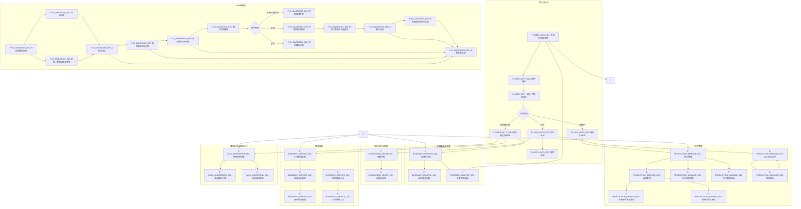
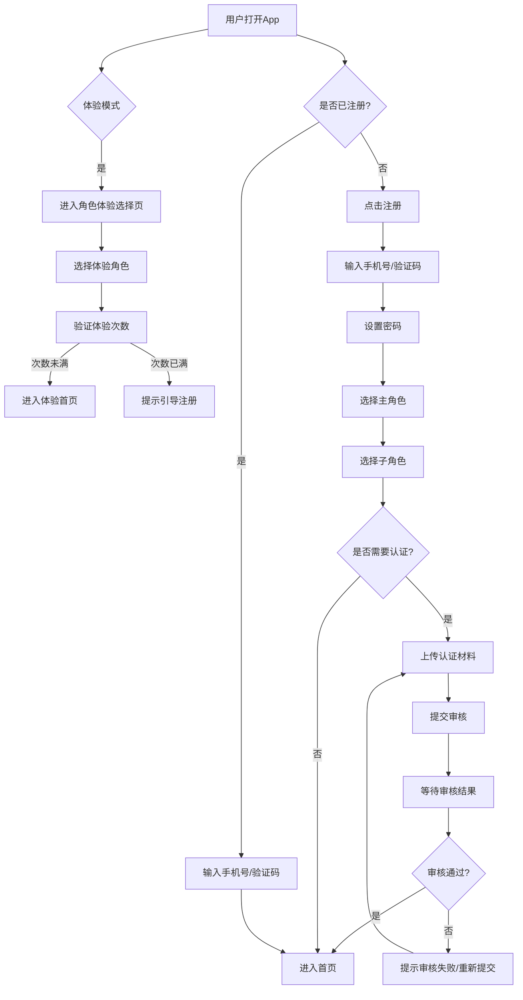
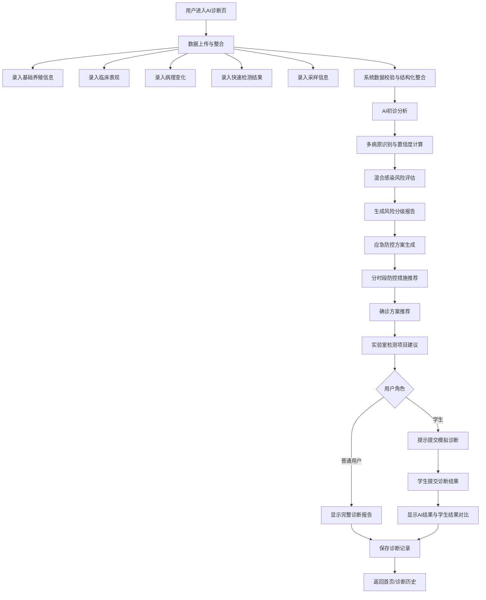
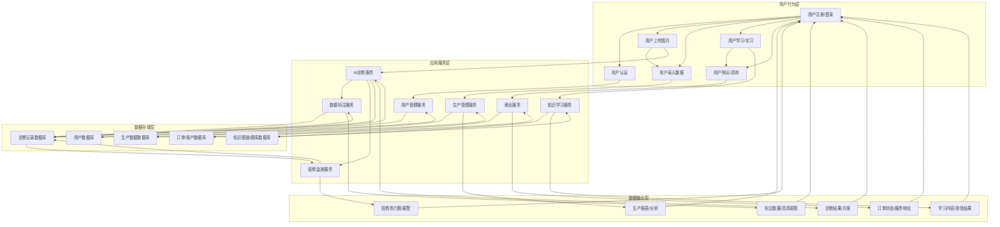

# 禽康智检产品需求文档
文档版本：v5.1
适用范围：后端开发、算法开发、前端开发、测试、移动应用构建与部署
更新日期：2025-12-09
更新内容：
1. 调整技术栈以适配Expo 54.0.18
2. 优化环境配置，适配Windows 11开发环境
3. 增加应用构建与发布流程
4. 添加账号配置信息
5. 更新产品概述，明确技术实现方式

## 1. 产品概述

### 1.1 产品名称与定位
*   **产品名称:** 禽康智检 (Qinkang Zhijian)
*   **产品定位:** 一款面向禽类养殖产业链各环节用户的移动端综合服务平台，基于React Native + Expo技术栈开发，通过AI技术赋能，专注于实现多病原混合感染的智能化诊断、风险评估、防控方案生成及确诊指引，提供疾病诊断、生产管理、疫情监测、学习教育及商业服务一体化解决方案。
*   **产品应用语言:** 中文

### 1.2 产品愿景与目标
*   **产品愿景:** 成为禽类养殖行业智能化、数字化转型的引领者，构建健康、高效、可持续的禽类养殖生态系统。
*   **核心目标:** 实现多病原混合感染的智能化诊断、风险评估、防控方案生成及确诊指引
*   **产品目标:**
    *   提升禽类疾病诊断效率与准确性，降低养殖风险。
    *   优化养殖生产管理流程，提高生产效率。
    *   建立疫情监测预警机制，辅助疫病防控。
    *   提供便捷的养殖知识学习与实习教学管理工具。
    *   促进养殖产业链上下游信息流通与商业合作。
    *   实现跨平台移动端应用，支持iOS和Android系统。

### 1.3 产品使用终端与技术实现
*   **主要终端:** 移动端App (iOS & Android)
*   **技术实现:** 基于Expo 54.0.18构建的React Native应用
*   **后端技术:** Node.js + Express + MongoDB
*   **AI技术:** 百度云图像识别API + 阿里云NLP - 智能诊断引擎
*   **开发模式:** 前后端分离，模块化开发
*   **构建与部署:** 使用Expo Build Service进行应用构建和发布

### 1.4 核心价值主张
*   **AI赋能:** 利用先进的AI多病原分析技术，实现禽类疾病的快速、准确诊断，尤其针对混合感染情况。
*   **数据驱动:** 提供多维度数据洞察，辅助科学决策，提升养殖效益。
*   **生态协同:** 连接养殖户、机构、学生等多方角色，构建信息共享与协作平台。
*   **专业服务:** 整合行业资源，提供定制化解决方案与专业知识支持。

### 1.5 目标用户群体分析

| 用户角色         | 细分类型       | 核心诉求                               | 典型使用场景                                   |
| :--------------- | :------------- | :------------------------------------- | :--------------------------------------------- |
| **养殖户**       | 小散户         | 降本增效、快速止损、简易操作           | 发现病禽，快速诊断并获取治疗方案。             |
|                  | 合作社         | 统一管理、数据汇总、内部协作           | 管理社员数据，统一采购，下发通知。             |
|                  | 养殖企业       | 规模化管理、精细化数据、员工权限       | 批次管理、死淘率分析、员工绩效追踪。           |
| **机构**         | 疫控机构       | 疫情监测、预警、政策传达               | 实时查看辖区疫情热力图，接收异常报警。         |
|                  | 科研院所       | 数据采集、病例标注、科研协作           | 下载高清病例图片，进行标注和研究。             |
|                  | 服务商         | 精准营销、客户管理、在线服务           | 基于诊断结果投放广告，管理客户档案。           |
| **学术端**       | 学生（学习）   | 理论学习、知识巩固                     | 浏览病理图谱，进行知识闯关测验。               |
|                  | 学生（认知实习） | 模拟实战、技能提升                     | 访问脱敏病例库进行模拟诊断，比对AI结果。       |
|                  | 学生（顶岗实习） | 实习记录、报告生成、导师互动           | 拍照记录现场病例，生成实习报告，接收导师批注。 |
|                  | 教师           | 实习管理、学生指导、报告批改           | 查看学生实习日志，远程批注，管理实习组。       |

### 1.6 市场需求与竞品简析

*   **市场需求:**
    *   **疾病诊断痛点:** 传统诊断依赖经验，耗时且准确性有限，尤其对小散户而言，缺乏专业兽医资源。AI诊断能快速提供初步判断，为及时止损争取时间。
    *   **生产管理痛点:** 规模化养殖企业对精细化管理、数据追溯有强烈需求，传统人工记录效率低、易出错。SaaS化管理工具能显著提升效率。
    *   **疫情防控痛点:** 疫情爆发往往具有突发性和扩散性，缺乏早期预警和实时监测机制，易造成大规模损失。
    *   **人才培养痛点:** 农业院校学生实习实践环节缺乏有效管理工具，理论与实践脱节，实习效果难以量化评估。
    *   **产业链协同痛点:** 养殖户、兽药企业、监管机构之间信息不对称，缺乏高效的沟通与协作平台。
*   **竞品简析:**
    *   **AI诊断类:** 市场上已有部分专注于AI图像识别的禽病诊断工具，但多为单一功能，缺乏与生产管理、疫情监测等环节的深度整合。
    *   **生产管理类:** 存在一些养殖管理SaaS系统，但通常功能复杂，价格昂贵，不适合小散户，且与AI诊断结合度不高。
    *   **信息平台类:** 部分农业信息平台提供养殖知识、行情等，但缺乏互动性和个性化服务。
    *   **本产品优势:** 禽康智检通过整合AI诊断、多角色管理、生产SaaS、疫情预警、学习教育和商业服务，形成一站式综合解决方案，覆盖产业链多环节，提供差异化服务，形成独特竞争优势。

## 2. 功能规格

### 2.0 AI能力调用说明

#### 2.0.1 百度云图像识别集成
- **服务类型**: 图像识别API
- **AppID**: 121236834
- **API Key**: 2VZjQEtazEqJzymtkjpX8het
- **Secret Key**: YDSdbq1BzCbPYozSvCSSL0PE8QTLrLjp
- **集成场景**: 
  - F-AI_DIAGNOSIS_002: 对话问诊
  - F-AI_DIAGNOSIS_003: 阶段一数据上传与整合
  - F-AI_DIAGNOSIS_004: 阶段二数据上传与整合
  - F-AI_DIAGNOSIS_005: AI初诊分析
  - F-AI_DIAGNOSIS_006: AI确诊分析
- **调用流程**: 
  1. 用户上传图片
  2. 前端对图片进行预处理（压缩、裁剪）
  3. 调用百度云图像识别API
  4. 接收识别结果，包含病原特征、置信度等
  5. 前端展示初步识别结果

#### 2.0.2 阿里云NLP - 智能诊断引擎集成
- **服务类型**: 自然语言处理API
- **accessKeyId**: [配置在环境变量中]
- **accessKeySecret**: [配置在环境变量中]
- **集成场景**: 
  - F-AI_DIAGNOSIS_002: 对话问诊
  - F-AI_DIAGNOSIS_005: AI初诊分析
  - F-AI_DIAGNOSIS_006: AI确诊分析
  - F-AI_DIAGNOSIS_007: 混合感染风险评估
  - F-AI_DIAGNOSIS_008: 应急防控方案生成
  - F-AI_DIAGNOSIS_009: 生物安全体系优化方案
  - F-AI_DIAGNOSIS_010: 确诊方案推荐
  - F-AI_DIAGNOSIS_011: 学生模拟诊断
- **结构化提示词设计**:
  
  **2.0.2.1 对话问诊提示词**
  - **系统角色**:
    ```
    你是一位专业的禽病兽医，擅长诊断各种禽类疾病。请根据用户提供的症状描述和图片分析结果，给出初步诊断建议。
    ```
  - **用户输入**:
    ```
    用户症状描述：{user_description}
    图片分析结果：{image_analysis}
    ```
  - **输出格式**:
    ```json
    {
      "preliminaryDiagnosis": "初步诊断结果",
      "confidence": 0.9,
      "suggestions": [
        "建议1",
        "建议2"
      ],
      "nextSteps": "后续建议操作"
    }
    ```
  
  **2.0.2.2 混合感染风险评估提示词**
  - **系统角色**:
    ```
    你是一位禽病流行病学专家，擅长评估禽类混合感染风险。请根据提供的诊断数据，评估不同病原组合的混合感染风险。
    ```
  - **用户输入**:
    ```
    诊断数据：{diagnosis_data}
    初步诊断结果：{preliminary_diagnosis}
    ```
  - **输出格式**:
    ```json
    {
      "riskLevel": "HIGH",
      "infectionCombinations": [
        {
          "pathogens": ["禽流感病毒 (H9N2)", "新城疫病毒"],
          "probability": 0.82
        }
      ],
      "coreThreat": "混合感染可能导致的核心威胁"
    }
    ```
  
  **2.0.2.3 应急防控方案生成提示词**
  - **系统角色**:
    ```
    你是一位禽病防控专家，擅长制定应急防控方案。请根据诊断结论，按"紧急控制-短期治疗-生物安全"三个维度，生成分时段、分场景的标准化防控方案。
    ```
  - **用户输入**:
    ```
    诊断结论：{diagnosis_conclusion}
    风险评估：{risk_assessment}
    ```
  - **输出格式**:
    ```json
    {
      "emergencyControl": [
        "紧急控制措施1",
        "紧急控制措施2"
      ],
      "shortTermTreatment": [
        "短期治疗方案1",
        "短期治疗方案2"
      ],
      "biosecurityMeasures": [
        "生物安全措施1",
        "生物安全措施2"
      ],
      "timeline": {
        "0-24小时": ["措施1", "措施2"],
        "1-7天": ["措施3", "措施4"],
        "7-14天": ["措施5", "措施6"]
      }
    }
    ```
  
  **2.0.2.4 生物安全体系优化方案提示词**
  - **系统角色**:
    ```
    你是一位生物安全专家，擅长优化养殖场生物安全体系。请根据诊断结论，生成针对性的生物安全体系优化方案。
    ```
  - **用户输入**:
    ```
    诊断结论：{diagnosis_conclusion}
    养殖场基本情况：{farm_info}
    ```
  - **输出格式**:
    ```json
    {
      "facilityOptimization": [
        "设施优化建议1",
        "设施优化建议2"
      ],
      "managementImprovement": [
        "管理改进建议1",
        "管理改进建议2"
      ],
      "personnelTraining": [
        "人员培训建议1",
        "人员培训建议2"
      ],
      "monitoringSystem": [
        "监测系统建议1",
        "监测系统建议2"
      ]
    }
    ```
  
  **2.0.2.5 确诊方案推荐提示词**
  - **系统角色**:
    ```
    你是一位实验室诊断专家，擅长推荐确诊方案。请根据初诊结果，推荐分层级的实验室检测方案。
    ```
  - **用户输入**:
    ```
    初诊结果：{preliminary_diagnosis}
    风险等级：{risk_level}
    ```
  - **输出格式**:
    ```json
    {
      "emergencyTests": [
        {
          "testName": "紧急检测项目1",
          "method": "检测方法",
          "sampleType": "样本类型"
        }
      ],
      "importantTests": [
        {
          "testName": "重要检测项目1",
          "method": "检测方法",
          "sampleType": "样本类型"
        }
      ],
      "inDepthTests": [
        {
          "testName": "深入检测项目1",
          "method": "检测方法",
          "sampleType": "样本类型"
        }
      ]
    }
    ```
  
  **2.0.2.6 学生模拟诊断提示词**
  - **系统角色**:
    ```
    你是一位禽病学教师，擅长指导学生进行禽病诊断。请根据提供的病例数据，先让学生提交诊断结果，然后给出AI诊断结果和评分。
    ```
  - **用户输入**:
    ```
    病例数据：{case_data}
    学生诊断结果：{student_diagnosis}
    ```
  - **输出格式**:
    ```json
    {
      "aiDiagnosis": "AI诊断结果",
      "studentScore": 85,
      "feedback": "对学生诊断的详细反馈",
      "keyPoints": [
        "诊断关键点1",
        "诊断关键点2"
      ]
    }
    ```
- **调用流程**: 
  1. 收集诊断数据（包括百度云图像识别结果、用户录入数据）
  2. 根据具体场景选择对应的结构化提示词
  3. 调用阿里云NLP - 智能诊断引擎进行风险评估和方案生成
  4. 接收生成结果，包含风险等级、防控方案、确诊建议等
  5. 前端展示完整诊断报告

### 2.1 功能详述

#### 2.1.1 用户与认证管理 (F-USER_AUTH)

| 功能ID | 功能名称 | 功能描述 | 优先级 | 适用角色 |
|--------|---------|---------|--------|----------|
| F-USER_AUTH_001 | 手机号注册/登录 | 用户通过手机号接收验证码完成注册和登录，也可用手机号和注册时设置的登录密码登录。 | P0 | 所有角色 |
| F-USER_AUTH_002 | 角色选择 | 新用户注册时，引导选择“养殖户”、“机构”、“学生”等主角色。 | P0 | 新用户 |
| F-USER_AUTH_003 | 子角色选择 | 根据主角色选择，进一步选择细分类型（如小散户、养殖企业、疫控机构、学习阶段学生等）。 | P0 | 新用户 |
| F-USER_AUTH_004 | 养殖户认证 | 养殖企业/合作社用户需上传营业执照进行认证，审核通过后解锁高级功能。 | P0 | 养殖户（企业/合作社） |
| F-USER_AUTH_005 | 学生认证 | 学生用户需绑定学校/学号，并可输入导师邀请码加入实习组。 | P0 | 学生 |
| F-USER_AUTH_006 | 机构/服务商认证 | 机构（疫控机构、科研院所）/服务商用户需上传兽医资格证（教师资格证）、经营许可证等进行人工审核。 | P0 | 机构（政府疫控人员、科研机构研究人员或高校教师）/服务商 |
| F-USER_AUTH_007 | 导师关联 | 学生用户通过导师邀请码与导师账号关联，导师可查看学生实习数据。 | P0 | 学生、教师 |
| F-USER_AUTH_008 | 体验模式入口 | 未登录用户可通过"体验APP"按钮进入角色体验模式，无需注册登录。 | P1 | 未登录用户 |
| F-USER_AUTH_009 | 体验次数限制 | 每个设备每天最多可体验10次不同角色，每次体验时长不超过24小时，最多可体验15天。 | P1 | 未登录用户 |

#### 2.1.2 AI诊断模块 (F-AI_DIAGNOSIS)

| 功能ID | 功能名称 | 功能描述 | 优先级 | 适用角色 |
|--------|---------|---------|--------|----------|
| F-AI_DIAGNOSIS_001 | AI诊断模式选择 | 支持用户选择AI诊断模式：对话问诊模式或AI兽医模式。 | P0 | 所有角色 |
| F-AI_DIAGNOSIS_002 | 对话问诊 | 支持用户通过文字描述症状、上传图片，与AI进行多轮对话，获取初步诊断建议。 | P0 | 所有角色 |
| F-AI_DIAGNOSIS_003 | 阶段一数据上传与整合 | 支持用户标准化录入养殖基础信息、临床表现，系统自动完成数据校验与结构化整合。 | P0 | 养殖户、学生（实习）、机构（科研院所）、机构（服务商） |
| F-AI_DIAGNOSIS_004 | 阶段二数据上传与整合 | 支持用户标准化录入病理变化、快速检测结果、采样信息及实验数据，系统自动完成数据校验与结构化整合。 | P0 | 机构（科研院所）、机构（服务商） |
| F-AI_DIAGNOSIS_005 | AI初诊分析 | 基于基础信息、临床表现，通过算法模型匹配病原特征、判定混合感染类型及风险等级，生成带置信度的初诊结论。 | P0 | 所有角色 |
| F-AI_DIAGNOSIS_006 | AI确诊分析 | 基于完整数据（基础信息、临床表现、病理变化、快速检测结果、采样信息及实验数据），通过算法模型进行综合分析，生成确诊结论。 | P0 | 机构（科研院所）、机构（服务商） |
| F-AI_DIAGNOSIS_007 | 混合感染风险评估 | 评估不同病原组合的混合感染风险，识别高风险组合及继发感染可能性，按风险等级排序。 | P0 | 所有角色 |
| F-AI_DIAGNOSIS_008 | 应急防控方案生成 | 基于诊断结论，按"紧急控制-短期治疗-生物安全"三个维度，生成分时段、分场景的标准化防控方案。 | P0 | 所有角色 |
| F-AI_DIAGNOSIS_009 | 生物安全体系优化方案 | 基于诊断结论，生成针对性的生物安全体系优化方案。 | P0 | 所有角色 |
| F-AI_DIAGNOSIS_010 | 确诊方案推荐 | 基于初诊方向，推荐分层级的实验室检测方案，明确检测项目、方法、时间节点及样本要求。 | P0 | 所有角色 |
| F-AI_DIAGNOSIS_011 | 学生模拟诊断 | 学生用户在虚拟诊断模式下，先提交自己的诊断判断，再查看AI结果进行比对学习。 | P0 | 学生（学习/实习） |
| F-AI_DIAGNOSIS_012 | 诊断历史记录 | 记录用户所有诊断历史，包括完整数据、分析过程和方案，方便查阅和管理。 | P0 | 所有角色 |
| F-AI_DIAGNOSIS_013 | AI诊断报告审核 | 支持专业人员（科研院所、服务商）审核和修订AI诊断报告。 | P0 | 机构（科研院所）、机构（服务商） |
| F-AI_DIAGNOSIS_014 | 诊疗服务下单 | 支持用户基于AI初诊报告下单诊疗服务，选择科研院所或服务商相关人员/团队。 | P0 | 养殖户、机构（服务商）、机构（科研院所） |
| F-AI_DIAGNOSIS_015 | 实验数据管理 | 支持用户上传和管理相关的实验室诊断项目的数据。 | P0 | 机构（科研院所）、机构（服务商） |
#### 2.1.3 生产管理 (F-PRODUCTION_MANAGE)

| 功能ID | 功能名称 | 功能描述 | 优先级 | 适用角色 |
|--------|---------|---------|--------|----------|
| F-PRODUCTION_MANAGE_001 | 批次管理 | 养殖企业用户可创建和管理养殖批次，记录批次信息（品种、数量、入栏日期等）。 | P0 | 养殖户（企业/合作社） |
| F-PRODUCTION_MANAGE_002 | 存栏管理 | 记录各批次禽只的实时存栏数量。 | P0 | 养殖户（企业/合作社） |
| F-PRODUCTION_MANAGE_003 | 死淘率记录与分析 | 记录每日死淘数量，自动计算死淘率，并生成死淘率曲线图。 | P0 | 养殖户（企业/合作社） |
| F-PRODUCTION_MANAGE_004 | 耗料记录与分析 | 记录每日饲料消耗量，生成耗料分析报告。 | P0 | 养殖户（企业/合作社） |
| F-PRODUCTION_MANAGE_005 | 员工权限管理 | 养殖企业用户可为场长、饲养员等不同角色分配不同的系统操作权限。 | P0 | 养殖户（企业/合作社） |
| F-PRODUCTION_MANAGE_006 | 生产数据导出 | 养殖企业用户可将生产数据导出为Excel格式。 | P0 | 养殖户（企业/合作社） |
| F-PRODUCTION_MANAGE_007 | 实习日志记录 | 学生用户可拍照记录现场病例，填写实习日志，并生成实习报告。 | P0 | 学生（实习） |
| F-PRODUCTION_MANAGE_008 | 导师批注 | 导师用户可对学生提交的实习日志和报告进行远程批注和指导。 | P0 | 教师 |

#### 2.1.4 疫情监测与预警 (F-EPIDEMIC_MONITOR)

| 功能ID | 功能名称 | 功能描述 | 优先级 | 适用角色 |
|--------|---------|---------|--------|----------|
| F-EPIDEMIC_MONITOR_001 | 疫情热力图 | 疫控机构用户可查看基于用户上传坐标生成的疾病热力图，直观展示疫情分布。 | P0 | 机构（疫控）、机构（科研院所） |
| F-EPIDEMIC_MONITOR_002 | 异常高发报警 | 系统自动识别异常高发区域或疾病，并向疫控机构用户发送报警通知。 | P0 | 机构（疫控） |
| F-EPIDEMIC_MONITOR_003 | 政策下发通道 | 疫控机构用户可通过平台向指定区域或用户群体下发防疫政策和通知。 | P0 | 机构（疫控） |

#### 2.1.5 知识学习与题库 (F-KNOWLEDGE_LEARN)

| 功能ID | 功能名称 | 功能描述 | 优先级 | 适用角色 |
|--------|---------|---------|--------|----------|
| F-KNOWLEDGE_LEARN_001 | 图谱百科 | 提供禽类典型病理图谱的浏览功能，包含疾病名称、症状描述、图片等。 | P0 | 所有角色 |
| F-KNOWLEDGE_LEARN_002 | 题库与测验 | 提供禽病知识闯关测验，学生用户可进行在线答题，巩固理论知识。 | P0 | 学生（学习） |

#### 2.1.6 商业服务 (F-BUSINESS_SERVICE)

| 功能ID | 功能名称 | 功能描述 | 优先级 | 适用角色 |
|--------|---------|---------|--------|----------|
| F-BUSINESS_SERVICE_001 | 广告精准投放 | 服务商用户可基于AI诊断结果和用户画像进行兽药、饲料、疫苗等产品的精准广告投放。 | P0 | 机构（服务商） |
| F-BUSINESS_SERVICE_002 | 在线诊疗接单 | 服务商用户可接收养殖户的在线诊疗请求并进行接单处理。 | P0 | 机构（服务商） |
| F-BUSINESS_SERVICE_003 | 客户档案管理 | 服务商用户可管理客户档案，记录客户养殖情况、历史订单等信息。 | P0 | 机构（服务商） |
| F-BUSINESS_SERVICE_004 | 兽药商城入口 | 为养殖户提供兽药、饲料、疫苗等产品的在线购买入口。 | P0 | 养殖户 |
| F-BUSINESS_SERVICE_005 | 大宗采购入口 | 为养殖企业提供大宗兽药、饲料、疫苗等产品的在线采购入口。 | P0 | 养殖户（企业/合作社） |

#### 2.1.7 数据标注与科研协作 (F-DATA_ANNOTATION)

| 功能ID | 功能名称 | 功能描述 | 优先级 | 适用角色 |
|--------|---------|---------|--------|----------|
| F-DATA_ANNOTATION_001 | 特殊病例采集 | 科研院所用户可标记和采集系统中的特殊病例数据。 | P0 | 机构（科研院所） |
| F-DATA_ANNOTATION_002 | 高清原图下载 | 科研院所用户在获得授权后，可下载AI诊断所用的高清原始图片。 | P0 | 机构（科研院所） |
| F-DATA_ANNOTATION_003 | 科研协作群组 | 科研院所用户可创建和管理科研协作群组，共享数据和研究成果。 | P0 | 机构（科研院所） |

### 2.2 功能模块间的关系图



## 3. 用户流程

### 3.1 用户旅程地图

| 阶段         | 用户目标                       | 用户行为                               | 系统响应/支持                               | 痛点/机遇                                  |
| :----------- | :----------------------------- | :------------------------------------- | :------------------------------------------ | :----------------------------------------- |
| **注册/登录** | 首次使用/再次访问              | 下载App -> 手机号注册/登录 -> 选择角色 -> 认证 | 引导注册/登录 -> 角色选择 -> 认证流程 -> 进入首页 | 注册流程繁琐/认证不清晰 -> 优化流程，明确指引 |
| **AI诊断**   | 快速判断禽病                   | 拍照上传 -> 等待结果 -> 查看方案       | AI分析 -> 显示诊断结果 -> 推荐治疗方案      | 诊断不准/方案不适用 -> 提升AI准确率，提供定制方案 |
| **生产管理** | 记录/分析生产数据              | 录入数据 -> 查看报表 -> 导出数据       | 数据存储 -> 生成图表/报表 -> 提供导出功能   | 数据分散/分析困难 -> 集中管理，可视化分析 |
| **疫情监测** | 了解疫情动态/接收预警          | 查看热力图 -> 接收报警                 | 实时更新热力图 -> 发送报警通知              | 信息滞后/预警不及时 -> 实时数据，智能预警 |
| **学习/实习** | 学习知识/完成实习任务          | 浏览图谱 -> 答题测验 -> 记录日志 -> 提交报告 | 提供学习资源 -> 自动批改 -> 导师批注        | 理论实践脱节/报告难管理 -> 模拟实战，在线提交 |
| **商业服务** | 购买产品/获取服务              | 浏览商城 -> 下单/咨询                  | 展示商品 -> 处理订单/咨询                   | 信息不对称/购买不便 -> 精准推荐，便捷交易 |

### 3.2 关键路径流程图

#### 3.2.1 用户注册与登录流程



#### 3.2.2 AI诊断核心流程



### 3.3 各场景下的用户操作步骤

#### 3.3.1 小散户用户：AI诊断与治疗方案获取

1.  **打开App:** 用户启动禽康智检App。
2.  **进入AI诊断:** 在首页点击“AI诊断”入口。
3.  **选择诊断模式:** 进入AI诊断模式选择页面，选择“对话问诊模式”或“AI兽医模式”。
4.  **诊断流程:**
    *   **对话问诊模式:** 直接用文字描述症状，上传图片，采用对话模式，支持多轮对话，获取AI初步诊断建议。
    *   **AI兽医模式:** 进入标准化诊断流程：
        *   **阶段一:** 录入基础信息、临床表现，提交后获取AI初诊报告。
        *   **AI初诊报告:** 查看发病基本情况、AI初诊结论（按置信度排名的可能疾病和诊断依据）、应急处置建议、确诊建议方案。
5.  **诊疗服务下单:** （可选）基于AI初诊报告，选择科研院所或服务商相关人员/团队，下单诊疗服务。
6.  **完成:** 用户可选择返回首页或查看历史诊断记录。

#### 3.3.2 科研院所/服务商用户：AI诊断与报告审核

1.  **打开App:** 用户启动禽康智检App。
2.  **进入AI诊断:** 在首页点击“AI诊断”入口。
3.  **选择诊断模式:** 进入AI诊断模式选择页面，选择“对话问诊模式”或“AI兽医模式”。
4.  **诊断流程:**
    *   **对话问诊模式:** 直接用文字描述症状，上传图片，采用对话模式，支持多轮对话，获取AI初步诊断建议。
    *   **AI兽医模式:** 进入标准化诊断流程：
        *   **阶段一:** 录入基础信息、临床表现，提交后获取AI初诊报告。
        *   **AI初诊报告审核:** 查看并审核AI初诊报告，可进行修订。
        *   **阶段二:** 录入病理变化、快速检测结果、采样信息及实验数据，提交后获取AI确诊结果。
        *   **AI确诊报告:** 查看AI确诊结论报告、应急防治方案、生物安全体系优化方案。
5.  **报告审核与反馈:** 审核最终报告，确认无误后反馈给用户。
6.  **完成:** 用户可选择返回首页或查看历史诊断记录。

#### 3.3.3 养殖企业用户：生产数据录入与分析

1.  **打开App:** 用户启动禽康智检App。
2.  **进入生产管理:** 在首页点击“生产管理”入口。
3.  **选择批次:** 选择需要操作的养殖批次。
4.  **录入数据:** 进入批次详情页，点击“录入数据”，选择“死淘记录”或“耗料记录”，输入当日数据。
5.  **保存数据:** 确认数据无误后点击保存。
6.  **查看分析:** 返回批次详情页，系统自动更新死淘率曲线和耗料分析图表。
7.  **导出数据:** 用户可点击“导出数据”按钮，将生产数据导出为Excel文件。
8.  **完成:** 用户可选择返回首页或继续管理其他批次。

#### 3.3.4 学生用户：实习日志记录与提交

1.  **打开App:** 用户启动禽康智检App。
2.  **进入实习日志:** 在首页点击“实习日志”入口。
3.  **创建新日志:** 点击“新建日志”按钮。
4.  **填写信息:** 填写日志日期、实习内容、观察记录等文本信息。
5.  **上传图片:** 点击“上传图片”，拍摄或选择现场病例图片。
6.  **提交日志:** 确认信息无误后点击“提交”按钮。
7.  **查看批注:** 导师批注后，学生可在日志详情页查看导师的评语和建议。
8.  **完成:** 用户可选择返回首页或继续创建其他日志。

## 4. 数据流设计

### 4.1 数据结构与关系

*   **用户表 (Users)**
    *   `user_id` (PK)
    *   `phone_number` (Unique)
    *   `password_hash`
    *   `nickname`
    *   `role_type` (Enum: 'FARMER', 'INSTITUTION', 'STUDENT', 'TEACHER')
    *   `sub_role` (Enum: 'SMALL', 'COOPERATIVE', 'ENTERPRISE', 'CDC', 'RESEARCH_INSTITUTE', 'SERVICE_PROVIDER', 'LEARNING_STUDENT', 'COGNITIVE_INTERN', 'ADVANCED_INTERN')
    *   `organization_id` (FK, 关联所属组织，如某大学、某合作社)
    *   `auth_status` (Enum: 'UNVERIFIED', 'PENDING', 'VERIFIED')
    *   `registration_date`
    *   `last_login_date`
    *   `school_id` (For students)
    *   `student_id` (For students)
    *   `mentor_id` (FK, For students,关联导师ID)

*   **组织机构表 (Organizations)**
    *   `org_id` (PK)
    *   `name` (如：XX农业大学、XX养殖集团)
    *   `type` (Enum: 'SCHOOL', 'ENTERPRISE', 'GOV', 'RESEARCH_INSTITUTE', 'SERVICE_PROVIDER')
    *   `license_img_url` (证照图片URL)
    *   `contact_person`
    *   `contact_phone`
    *   `address`

*   **诊断记录表 (Diagnosis_Records)**
    *   `record_id` (PK)
    *   `user_id` (FK)
    *   `diagnosis_time`
    *   `diagnosis_mode` (Enum: 'CHAT', 'VET', 诊断模式)
    *   `basic_info` (JSON, 基础养殖信息)
    *   `clinical_symptoms` (JSON, 临床表现)
    *   `pathological_changes` (JSON, 病理变化)
    *   `rapid_test_results` (JSON, 快速检测结果)
    *   `sampling_info` (JSON, 采样信息)
    *   `experimental_data` (JSON, 实验数据)
    *   `chat_history` (JSON, 对话历史，仅对话问诊模式)
    *   `single_diagnosis` (JSON, 单项病原诊断结果)
    *   `mixed_infection_risk` (JSON, 混合感染风险分级)
    *   `core_threat` (Text, 核心威胁提示)
    *   `emergency_measures` (JSON, 应急防控方案)
    *   `diagnosis_plan` (JSON, 确诊方案推荐)
    *   `final_diagnosis` (JSON, AI确诊结论报告)
    *   `emergency_prevention_plan` (JSON, 应急防治方案)
    *   `biosecurity_optimization_plan` (JSON, 生物安全体系优化方案)
    *   `location` (GPS坐标)
    *   `is_special_case` (Boolean, 是否被科研院所标记为特殊病例)
    *   `student_diagnosis_input` (Text, 学生模拟诊断输入)
    *   `mentor_comment_id` (FK, 关联导师批注ID)
    *   `audit_status` (Enum: 'UNREVIEWED', 'REVIEWED', 'REVISED', 报告审核状态)
    *   `auditor_id` (FK, 审核人ID)
    *   `audit_comments` (Text, 审核意见)

*   **养殖批次表 (Breeding_Batches)**
    *   `batch_id` (PK)
    *   `enterprise_id` (FK, 关联养殖企业用户ID)
    *   `batch_name`
    *   `species` (禽类品种)
    *   `initial_quantity`
    *   `entry_date`
    *   `current_quantity`
    *   `status` (Enum: 'ACTIVE', 'FINISHED')

*   **生产数据表 (Production_Data)**
    *   `data_id` (PK)
    *   `batch_id` (FK)
    *   `record_date`
    *   `death_count` (死淘数量)
    *   `feed_consumption` (耗料量)
    *   `recorder_id` (FK, 记录员用户ID)

*   **实习日志表 (Internship_Logs)**
    *   `log_id` (PK)
    *   `student_id` (FK)
    *   `mentor_id` (FK)
    *   `log_date`
    *   `content` (实习内容描述)
    *   `case_image_urls` (JSON/Array, 多张图片URL)
    *   `student_diagnosis` (学生填写的判断)
    *   `ai_reference` (AI给出的判断)
    *   `mentor_comment` (导师评语)
    *   `gps_location` (打卡地点)

*   **知识图谱表 (Knowledge_Graph)**
    *   `graph_id` (PK)
    *   `disease_name`
    *   `description`
    *   `symptoms` (JSON/Array)
    *   `image_urls` (JSON/Array)
    *   `related_diseases` (JSON/Array)

*   **题库表 (Question_Bank)**
    *   `question_id` (PK)
    *   `question_text`
    *   `options` (JSON/Array)
    *   `correct_answer`
    *   `knowledge_point`

*   **订单表 (Orders)**
    *   `order_id` (PK)
    *   `user_id` (FK, 养殖户)
    *   `service_provider_id` (FK, 服务商/科研院所)
    *   `product_type` (Enum: 'VETERINARY_DRUG', 'FEED', 'VACCINE', 'CONSULTATION', 'DIAGNOSIS_SERVICE')
    *   `diagnosis_record_id` (FK, 关联诊断记录ID，仅诊断服务订单)
    *   `quantity`
    *   `total_price`
    *   `service_description` (Text, 服务需求描述)
    *   `order_status` (Enum: 'PENDING', 'PROCESSING', 'COMPLETED', 'CANCELLED')
    *   `order_date`
    *   `assigned_to` (FK, 分配给的具体人员ID)
    *   `completion_date` (服务完成日期)

### 4.2 关键数据流向图



### 4.3 数据存储与处理原则

1.  **数据安全:**
    *   所有用户敏感数据（如手机号、密码、认证材料）进行加密存储和传输。
    *   严格的访问控制机制，确保只有授权用户和系统服务能访问对应数据。
    *   定期进行数据备份和灾难恢复演练。
2.  **数据隐私:**
    *   遵循相关数据隐私法规，明确告知用户数据用途和处理方式。
    *   对用户上传的图片和地理位置信息进行匿名化或去标识化处理，尤其在用于疫情监测和科研时。
    *   学生实习数据在未获得授权的情况下，仅导师和学生本人可见。
3.  **数据准确性与一致性:**
    *   建立数据校验机制，确保用户录入数据的准确性。
    *   采用事务管理，保证数据操作的原子性、一致性、隔离性和持久性。
    *   定期对数据进行清洗和校验，维护数据质量。
4.  **数据可追溯性:**
    *   关键操作（如诊断、数据修改、订单状态变更）均记录操作日志，便于追溯。
    *   诊断记录与原始图片关联，方便后续复核和科研使用。
5.  **数据存储:**
    *   结构化数据（用户信息、生产数据、订单等）存储在关系型数据库中。
    *   非结构化数据（图片、视频、文档）存储在对象存储服务中。
    *   AI模型和知识库存储在专用模型库和知识库中。
6.  **数据处理:**
    *   AI诊断服务实时处理用户上传图片，返回诊断结果。
    *   生产数据和疫情数据进行实时汇总和分析，生成可视化报表和预警信息。
    *   数据标注和科研协作数据按需进行处理和共享。

## 5. 技术栈与环境配置

### 5.1 前端技术栈
| 技术 | 版本/类型 | 用途 |
|------|-----------|------|
| Expo SDK | 54.0.18 | 跨平台移动端开发与构建 |
| React Native | Expo内置 | 移动端UI框架 |
| TypeScript | 最新稳定版 | 类型安全开发 |
| React Navigation | 最新稳定版 | 应用导航 |
| React Context + useReducer | 内置 | 状态管理 |
| Axios | 最新稳定版 | API请求 |
| React Native Paper | 最新稳定版 | UI组件库 |
| Tailwind CSS | 最新稳定版 | 样式设计与布局 |
| Expo ImagePicker | Expo内置 | 图片选择与上传 |
| Expo Camera | Expo内置 | 相机功能 |
| Expo MapView | Expo内置 | 地图服务集成 |

### 5.2 后端技术栈
| 技术 | 版本/类型 | 用途 |
|------|-----------|------|
| Node.js | 24.11.1 | 后端运行环境 |
| Express.js | 5.2.1 | Web框架 |
| MongoDB | 8.2.2 | 非关系型数据库（所有数据） |
| Mongoose | 9.0.1 | MongoDB ODM |
| JWT | 最新稳定版 | 认证授权 |
| bcrypt | 最新稳定版 | 密码加密 |
| CORS | 最新稳定版 | 跨域支持 |
| dotenv | 最新稳定版 | 环境变量管理 |
| morgan | 最新稳定版 | 请求日志 |

### 5.3 AI服务集成
| 服务 | 用途 |
|------|------|
| 百度云图像识别API | 病禽图片识别 |
| 阿里云NLP - 智能诊断引擎 | 风险评估、方案生成、诊断建议 |

### 5.4 开发环境
| 工具 | 版本 | 用途 |
|------|------|------|
| VS Code | 最新稳定版 | 代码编辑器 |
| Trae | 最新稳定版 | 辅助开发工具 |
| Git | 2.52.0 | 版本控制 |
| GitHub | - | 代码托管 |
| Postman | 最新稳定版 | API测试 |
| Jest | 最新稳定版 | 单元测试 |
| React Testing Library | 最新稳定版 | 前端测试 |

### 5.5 生产环境与部署
| 服务 | 配置 | 用途 |
|------|------|------|
| 云服务器 | 4核8G | 应用服务器 |
| MongoDB Atlas | M0 | 数据库存储（开发阶段） |
| AWS S3/阿里云OSS | 按需 | 对象存储（图片、视频） |
| Expo Build Service | - | 移动应用构建 |
| GitHub Actions | - | CI/CD |
| PM2 | 最新稳定版 | 后端进程管理 |

### 5.6 应用构建与发布
| 步骤 | 工具/服务 | 说明 |
|------|-----------|------|
| 代码管理 | Git + GitHub | 版本控制与代码托管 |
| 应用构建 | Expo Build Service | Android APK与iOS IPA构建 |
| 应用测试 | Expo Go | 开发阶段测试 |
| 应用发布 | Expo EAS | 应用商店提交 |

### 5.7 账号配置
| 服务 | 账号信息 |
|------|----------|
| Expo | zhongjian475 / Gong0218@@ |
| GitHub | zhongjian0328 / zhongjian0328@gmail.com |

## 6. 设计系统与一致性要求

### 6.1 颜色规范
| 颜色名称 | 十六进制值 | 用途说明 |
|----------|------------|----------|
| primary | #E6F7F3 | 辅助背景色，渐变起点 |
| secondary | #2DBBA1 | 主操作色，按钮、链接 |
| accent | #1F5E52 | 强调色，重要文本、图标 |
| success | #10B981 | 成功状态色 |
| warning | #F59E0B | 警告状态色 |
| error | #EF4444 | 错误状态色 |
| info | #3B82F6 | 信息状态色 |
| text-primary | #111827 | 主要文本色 |
| text-secondary | #4B5563 | 次要文本色，说明文字 |
| text-tertiary | #9CA3AF | tertiary 文本色，辅助说明 |
| bg-light | #F3F4F6 | 页面背景色 |
| card-bg | #FFFFFF | 卡片背景色 |
| border-color | #E5E7EB | 边框颜色 |

### 6.2 字体规范
| 字体类型 | 字体族 | 大小 | 字体权重 | 用途 | 代码对应示例 |
|---------|--------|------|----------|------|--------------|
| 页面标题 | -apple-system, BlinkMacSystemFont, Segoe UI, Roboto, sans-serif | 18px | 600 (semibold) | 页面主标题 | `<h1 id="page-title" class="text-lg font-semibold text-text-primary">广告投放</h1>` |
| 模块标题 | -apple-system, BlinkMacSystemFont, Segoe UI, Roboto, sans-serif | 18px | 600 (semibold) | 数据概览、广告列表等模块标题 | `<h2 id="overview-title" class="text-lg font-semibold text-text-primary mb-4">投放概览</h2>` |
| 卡片标题 | -apple-system, BlinkMacSystemFont, Segoe UI, Roboto, sans-serif | 16px | 600 (semibold) | 广告卡片标题 | `<h3 id="ad-title-1" class="font-semibold text-text-primary mb-1">高效禽流感疫苗推广</h3>` |
| 正文 | -apple-system, BlinkMacSystemFont, Segoe UI, Roboto, sans-serif | 14px | 400 (regular) | 广告描述、主要文本内容 | `<p id="ad-desc-1" class="text-sm text-text-secondary mb-2">针对冬季高发期，专业禽流感防控疫苗</p>` |
| 辅助文本 | -apple-system, BlinkMacSystemFont, Segoe UI, Roboto, sans-serif | 12px | 400 (regular) | 数据标签、说明文字 | `<span><i class="fas fa-eye mr-1"></i>曝光: 2,341</span>` |
| 按钮文本 | -apple-system, BlinkMacSystemFont, Segoe UI, Roboto, sans-serif | 14px | 500 (medium) | 按钮文字 | `<button id="new-ad-btn" class="bg-secondary text-white px-4 py-2 rounded-lg text-sm font-medium shadow-button">` |
| 数据数值 | -apple-system, BlinkMacSystemFont, Segoe UI, Roboto, sans-serif | 24px | 700 (bold) | 关键数据展示 | `<p class="text-2xl font-bold text-text-primary">12</p>` |
| 表单标签 | -apple-system, BlinkMacSystemFont, Segoe UI, Roboto, sans-serif | 14px | 500 (medium) | 表单字段标签 | `<label for="ad-title-input" class="block text-sm font-medium text-text-primary mb-2">广告标题</label>` |
| 模态框标题 | -apple-system, BlinkMacSystemFont, Segoe UI, Roboto, sans-serif | 18px | 600 (semibold) | 弹窗标题 | `<h3 class="text-lg font-semibold text-text-primary">新建广告</h3>` |

### 6.3 间距规范
| 间距 | 像素值 | 用途 |
|------|--------|------|
| xs | 2px | 元素内边距、小间距 |
| sm | 4px | 模块内元素间距 |
| md | 8px | 主要间距，模块间距 |
| lg | 16px | 大间距，页面区域间距 |
| xl | 24px | 超大间距，特殊区域 |

### 6.4 组件规范

#### 6.4.1 卡片组件
- 圆角：10px
- 阴影：0 2px 8px rgba(0, 0, 0, 0.06)
- 内边距：12px
- 交互效果：点击时缩放0.98倍，过渡时间0.1s

#### 6.4.2 按钮组件
- 圆角：8px
- 阴影：0 2px 4px rgba(59, 204, 165, 0.2)
- 内边距：12px 24px
- 交互效果：点击时缩放0.98倍，过渡时间0.1s
- 主按钮：secondary背景色，accent文字色
- 次要按钮：白色背景，secondary边框，secondary文字色

#### 6.4.3 输入框组件
- 圆角：8px
- 边框：1px solid #E5E7EB
- 内边距：12px
- 聚焦状态：边框颜色变为secondary，添加2px outline

### 6.5 布局规范

#### 6.5.1 顶部导航栏
- 高度：56px
- 背景色：white
- 阴影：0 2px 4px rgba(0, 0, 0, 0.05)
- 内容：左侧返回按钮（部分页面），中间标题，右侧操作按钮

#### 6.5.2 底部导航栏
- 高度：64px（包含安全区域）
- 背景色：white
- 阴影：0 -2px 4px rgba(0, 0, 0, 0.05)
- 角色适配：
  - 养殖户（小散户）：首页、AI诊断、我的
  - 养殖户（企业）：首页、生产管理、我的
  - 机构（疫控）：首页、疫情监测、我的
  - 机构（科研院所）：首页、数据标注、科研协作、我的
  - 机构（服务商）：首页、客户管理、我的
  - 机构（教师）：首页、实习管理、我的
  - 学生（学习）：首页、学习、我的
  - 学生（实习）：首页、实习、我的

各角色底部导航栏功能说明：
1. **养殖户（小散户）**：
   - 首页：核心功能入口与信息展示
   - AI诊断：进入AI诊断流程
   - 我的：个人信息与设置

2. **养殖户（企业）**：
   - 首页：生产数据看板与核心功能入口
   - 生产管理：批次管理、死淘/耗料记录等
   - 我的：个人信息与企业设置

3. **机构（疫控）**：
   - 首页：疫情热力图与预警信息
   - 疫情监测：疫情数据与政策下发
   - 我的：个人信息与机构设置

4. **机构（科研院所）**：
   - 首页：数据采集与协作入口
   - 数据标注：病例标注与管理
   - 科研协作：科研群组管理
   - 我的：个人信息与科研设置

5. **机构（服务商）**：
   - 首页：客户管理与营销入口
   - 客户管理：客户档案与互动记录
   - 我的：个人信息与服务设置

6. **机构（教师）**：
   - 首页：实习管理与学生指导入口
   - 实习管理：学生实习任务与报告管理
   - 我的：个人信息与教学设置

7. **学生（学习）**：
   - 首页：学习任务与知识入口
   - 学习：图谱百科与题库测验
   - 我的：个人信息与学习设置

8. **学生（实习）**：
   - 首页：实习日志与报告管理
   - 实习：实习任务与导师互动
   - 我的：个人信息与实习设置

#### 6.5.3 主要内容区域
- 内边距：16px
- 最大宽度：适配不同屏幕尺寸
- 布局：响应式设计，适配手机、平板

## 7. 页面规格

### 7.1 页面概览

| 页面ID | 页面名称 | 核心功能 |
|--------|---------|---------|
| P-LOGIN_REGISTER | 登录/注册页 | 用户身份验证与新用户注册，提供体验入口 |
| P-EXPERIENCE_ROLE | 角色体验选择页 | 未登录用户选择要体验的角色，查看体验说明 |
| P-ROLE_SELECT | 角色选择页 | 引导用户选择主角色和子角色 |
| P-AUTH_CERTIFICATION | 认证页 | 用户提交认证材料进行身份验证 |
| P-HOME_FARMER_SMALL | 养殖户（小散户）首页 | 小散户核心功能入口与信息展示 |
| P-HOME_FARMER_ENTERPRISE | 养殖户（企业）首页 | 养殖企业核心功能入口与数据看板 |
| P-HOME_INSTITUTION_CDC | 机构（疫控）首页 | 疫控机构疫情热力图与预警信息 |
| P-HOME_INSTITUTION_RESEARCH | 机构（科研院所）首页 | 科研院所数据采集与协作入口 |
| P-HOME_INSTITUTION_SERVICE | 机构（服务商）首页 | 服务商客户管理与营销入口 |
| P-HOME_INSTITUTION_TEACHER | 机构（教师）首页 | 教师实习管理与学生指导入口 |
| P-HOME_STUDENT_INTERNSHIP | 学生（实习）首页 | 学生实习日志与报告管理 |
| P-HOME_STUDENT_LEARNING | 学生（学习）首页 | 学生学习任务与知识入口 |
| P-AI_DIAGNOSIS_MODE_SELECT | AI诊断模式选择页 | 选择AI诊断模式：对话问诊模式或AI兽医模式 |
| P-AI_DIAGNOSIS_CHAT | 对话问诊模式页 | 文字描述症状、上传图片，与AI进行多轮对话，获取初步诊断建议 |
| P-AI_DIAGNOSIS_VET | AI兽医模式页 | 通过标准化流程进行AI诊断，包含两个阶段的数据录入 |
| P-AI_PRE_DIAGNOSIS_REPORT | AI初诊报告页 | 展示AI初诊结果，提供诊疗服务下单入口 |
| P-AI_FINAL_DIAGNOSIS_REPORT | AI确诊报告页 | 展示AI确诊结果、应急防治方案、生物安全体系优化方案 |
| P-MEDICAL_SERVICE_ORDER | 诊疗服务下单页 | 基于AI初诊报告下单诊疗服务 |
| P-AI_REPORT_AUDIT | AI诊断报告审核页 | 审核和修订AI诊断报告 |
| P-EMERGENCY_PLAN | 应急防控方案页 | 展示基于AI初诊结论生成的分时段、分场景标准化防控方案 |
| P-TREATMENT_PLAN | 治疗方案页 | 展示AI推荐的治疗方案 |
| P-PRODUCTION_DASHBOARD | 生产管理看板页 | 养殖企业生产数据总览 |
| P-BATCH_MANAGEMENT | 批次管理页 | 养殖批次创建、编辑与列表 |
| P-DEATH_FEED_RECORD | 死淘/耗料记录页 | 每日死淘与耗料数据录入 |
| P-EMPLOYEE_PERMISSION | 员工权限管理页 | 养殖企业员工角色与权限配置 |
| P-EPIDEMIC_HEATMAP | 疫情热力图页 | 疫控机构疫情分布可视化 |
| P-POLICY_PUBLISH | 政策下发页 | 疫控机构发布政策通知 |
| P-KNOWLEDGE_GRAPH | 图谱百科页 | 禽类病理图谱浏览 |
| P-QUESTION_BANK | 题库测验页 | 禽病知识在线测验 |
| P-INTERN_LOG_LIST | 实习日志列表页 | 学生实习日志列表与管理 |
| P-INTERN_LOG_DETAIL | 实习日志详情页 | 实习日志内容、图片与导师批注 |
| P-MENTOR_DASHBOARD | 导师管理页 | 导师查看学生实习数据与批注 |
| P-CUSTOMER_MANAGEMENT | 客户管理页 | 服务商客户档案与互动记录 |
| P-AD_PRECISION | 广告投放页 | 服务商广告精准投放管理 |
| P-ONLINE_CONSULT | 在线诊疗页 | 服务商在线诊疗接单与管理 |
| P-VETERINARY_MALL | 兽药商城页 | 养殖户兽药、饲料、疫苗购买 |
| P-BULK_PURCHASE | 大宗采购页 | 养殖企业大宗物资采购入口 |
| P-DATA_ANNOTATION | 数据标注页 | 科研院所病例标注与管理 |
| P-RESEARCH_COLLAB | 科研协作页 | 科研院所协作群组管理 |
| P-USER_PROFILE | 个人中心页 | 用户个人信息与设置 |
| P-SETTINGS | 设置页 | 应用通用设置 |
| P-DATA_EXPORT | 数据导出页 | 各类数据导出功能 |

### 7.2 页面详情

#### 7.2.1 登录/注册页（P-LOGIN_REGISTER）

*   **页面名称与目的:** 登录/注册页，用于用户进行账号登录或新用户注册。
*   **页面负责的核心功能:** 用户身份验证、新用户注册。
*   **主要UI元素与布局建议:**
    *   顶部Logo和产品名称。
    *   手机号输入框。
    *   验证码输入框及“获取验证码”按钮。
    *   “体验APP”按钮（位于页面底部，非注册/登录用户可见）。
    *   密码输入框（注册时）。
    *   “登录”/“注册”按钮。
    *   “忘记密码”链接。
    *   “用户协议”和“隐私政策”链接。
*   **页面需展示的关键数据:** 无。
*   **交互逻辑:**
    *   用户输入手机号，点击“获取验证码”，系统发送短信验证码。
    *   用户输入验证码，点击“登录”/“注册”，系统验证验证码并完成登录/注册。
    *   用户点击“体验APP”，进入角色体验选择页。

#### 7.2.2 角色选择页（P-ROLE_SELECT）

*   **页面名称与目的:** 角色选择页，引导新注册用户选择其主角色和子角色，以便系统提供个性化服务。
*   **页面负责的核心功能:** 用户角色分类。
*   **主要UI元素与布局建议:**
    *   顶部标题“请选择您的身份”。
    *   主角色选择区域：卡片式或列表式展示“养殖户”、“机构”、“学生”。
    *   子角色选择区域：根据主角色选择动态显示细分类型（如小散户、养殖企业、疫控机构、学习阶段学生等）。
    *   “下一步”或“完成”按钮。
*   **页面需展示的关键数据:** 无。
*   **交互逻辑:**
    *   用户选择主角色后，系统动态显示对应的子角色选项。
    *   用户选择子角色后，点击“下一步”，系统保存角色信息并进入认证页或首页。

#### 7.2.3 认证页（P-AUTH_CERTIFICATION）

*   **页面名称与目的:** 认证页，用于用户提交相关资质材料进行身份认证，以解锁特定功能。
*   **页面负责的核心功能:** 用户身份认证。
*   **主要UI元素与布局建议:**
    *   顶部标题“身份认证”。
    *   认证类型说明（如：养殖企业需上传营业执照，学生需绑定学校/学号）。
    *   表单输入项（如：学校名称、学号、导师邀请码）。
    *   图片上传区域（支持拍照或从相册选择，如营业执照、资格证）。
    *   “提交审核”按钮。
    *   认证状态提示（如：审核中、审核通过、审核失败）。
*   **页面需展示的关键数据:** 用户当前认证状态。
*   **交互逻辑:**
    *   用户填写表单信息，上传认证材料，点击“提交审核”。
    *   系统提交认证请求，显示“审核中”状态。
    *   审核结果通过消息通知用户，认证成功后解锁对应功能。

#### 7.2.4 养殖户（小散户）首页（P-HOME_FARMER_SMALL）

*   **页面名称与目的:** 养殖户（小散户）首页，提供小散户用户核心功能的快捷入口和重要信息展示。
*   **页面负责的核心功能:** AI诊断、治疗方案推荐、周边兽药店导航、兽药商城入口。
*   **主要UI元素与布局建议:**
    *   顶部导航栏：个人中心入口、消息通知。
    *   核心功能区：大尺寸“AI诊断”按钮，“治疗方案”、“兽药商城”、“周边兽药店”快捷入口。
    *   信息展示区：近期诊断历史摘要、养殖小贴士。
    *   底部导航栏：首页、AI诊断、我的。
*   **页面需展示的关键数据:** 近期诊断结果、养殖小贴士。
*   **交互逻辑:**
    *   点击“AI诊断”按钮，进入AI诊断页。
    *   点击“治疗方案”，进入治疗方案页。
    *   点击“兽药商城”，进入兽药商城页。
    *   点击“周边兽药店”，打开地图显示周边兽药店位置。

#### 7.2.5 养殖户（企业）首页（P-HOME_FARMER_ENTERPRISE）

*   **页面名称与目的:** 养殖户（企业）首页，作为养殖企业用户的SaaS管理看板，展示关键生产数据和快捷功能入口。
*   **页面负责的核心功能:** 生产数据总览、批次管理、死淘率/耗料分析、员工权限管理、数据导出、大宗采购入口。
*   **主要UI元素与布局建议:**
    *   顶部导航栏：个人中心入口、消息通知。
    *   核心数据看板：今日死淘数、疫苗倒计时、存栏量、死淘率曲线、耗料分析图表。
    *   快捷功能区：批次管理、员工权限、数据导出、大宗采购入口。
    *   底部导航栏：首页、生产管理、我的。
*   **页面需展示的关键数据:** 今日死淘数、疫苗倒计时、存栏量、死淘率曲线、耗料分析图表。
*   **交互逻辑:**
    *   点击数据看板中的图表区域，进入详细数据页面。
    *   点击“批次管理”，进入批次管理页。
    *   点击“员工权限”，进入员工权限管理页。
    *   点击“数据导出”，进入数据导出页。
    *   点击“大宗采购”，进入大宗采购页。

#### 7.2.6 机构（疫控）首页（P-HOME_INSTITUTION_CDC）

*   **页面名称与目的:** 机构（疫控）首页，作为疫控机构用户的核心工作平台，展示疫情热力图和异常报警信息。
*   **页面负责的核心功能:** 疫情热力图、异常高发报警、政策下发。
*   **主要UI元素与布局建议:**
    *   顶部导航栏：个人中心入口、消息通知。
    *   核心区域：GIS地图，实时显示辖区内的疾病热力图和报警红点。
    *   快捷功能区：政策下发入口。
    *   底部导航栏：首页、疫情监测、我的。
*   **页面需展示的关键数据:** 疫情热力图数据、异常报警信息。
*   **交互逻辑:**
    *   点击地图上的热力区域或报警红点，查看详细疫情信息。
    *   点击“政策下发”，进入政策下发页。

#### 7.2.7 机构（服务商）首页（P-HOME_INSTITUTION_SERVICE）

*   **页面名称与目的:** 机构（服务商）首页，作为兽药/饲料/疫苗企业用户的CRM系统入口，提供客户管理和营销工具。
*   **页面负责的核心功能:** 广告精准投放、在线诊疗接单、客户档案管理。
*   **主要UI元素与布局建议:**
    *   顶部导航栏：个人中心入口、消息通知。
    *   核心功能区：客户管理、广告投放、在线诊疗快捷入口。
    *   数据概览：今日咨询量、待处理订单数等。
    *   底部导航栏：首页、客户管理、我的。
*   **页面需展示的关键数据:** 今日咨询量、待处理订单数。
*   **交互逻辑:**
    *   点击“客户管理”，进入客户管理页。
    *   点击“广告投放”，进入广告投放页。
    *   点击“在线诊疗”，进入在线诊疗页。
    *   点击数据概览区域，查看详细数据统计。

#### 7.2.8 机构（教师）首页（P-HOME_INSTITUTION_TEACHER）

*   **页面名称与目的:** 机构（教师）首页，作为农业院校教师用户的实习管理平台，提供学生指导和报告批改工具。
*   **页面负责的核心功能:** 实习管理、学生指导、报告批改。
*   **主要UI元素与布局建议:**
    *   顶部导航栏：个人中心入口、消息通知。
    *   核心功能区：实习管理、学生指导、报告批改快捷入口。
    *   数据概览：待批改报告数、活跃学生数、实习组数等。
    *   底部导航栏：首页、实习管理、我的。
*   **页面需展示的关键数据:** 待批改报告数、活跃学生数、实习组数。
*   **交互逻辑:**
    *   点击“实习管理”，进入实习管理页。
    *   点击“学生指导”，进入学生列表页。
    *   点击“报告批改”，进入待批改报告列表页。
    *   点击数据概览区域，查看详细数据统计。

#### 7.2.9 机构（科研院所）首页（P-HOME_INSTITUTION_RESEARCH）

*   **页面名称与目的:** 机构（科研院所）首页，作为科研院所用户的数据采集和协作平台，提供病例标注和科研协作工具。
*   **页面负责的核心功能:** 数据采集、病例标注、科研协作。
*   **主要UI元素与布局建议:**
    *   顶部导航栏：个人中心入口、消息通知。
    *   核心功能区：数据标注、科研协作、病例采集快捷入口。
    *   数据概览：已标注病例数、科研群组数、待处理协作请求数等。
    *   底部导航栏：首页、数据标注、科研协作、我的。
*   **页面需展示的关键数据:** 已标注病例数、科研群组数、待处理协作请求数。
*   **交互逻辑:**
    *   点击“数据标注”，进入数据标注页。
    *   点击“科研协作”，进入科研协作页。
    *   点击“病例采集”，进入病例采集页。
    *   点击数据概览区域，查看详细数据统计。

#### 7.2.10 学生（学习）首页（P-HOME_STUDENT_LEARNING）

*   **页面名称与目的:** 学生（学习）首页，为学习阶段的学生提供知识学习和测验的入口。
*   **页面负责的核心功能:** 图谱百科、题库与测验。
*   **主要UI元素与布局建议:**
    *   顶部导航栏：个人中心入口、消息通知。
    *   核心功能区：图谱百科、题库测验快捷入口。
    *   学习任务区：今日学习任务、每日一病科普。
    *   底部导航栏：首页、学习、我的。
*   **页面需展示的关键数据:** 今日学习任务、每日一病科普内容。
*   **交互逻辑:**
    *   点击“图谱百科”，进入图谱百科页。
    *   点击“题库测验”，进入题库测验页。
    *   点击“今日学习任务”，进入对应的学习内容。

#### 7.2.11 学生（实习）首页（P-HOME_STUDENT_INTERNSHIP）

*   **页面名称与目的:** 学生（实习）首页，为顶岗实习的学生提供实习日志记录和报告管理的入口。
*   **页面负责的核心功能:** 实习日志记录、实习报告生成、导师批注查看。
*   **主要UI元素与布局建议:**
    *   顶部导航栏：个人中心入口、消息通知。
    *   核心功能区：实习日志列表、新建日志入口。
    *   导师批注提醒：显示导师最新批注。
    *   底部导航栏：首页、实习、我的。
*   **页面需展示的关键数据:** 实习日志列表、导师最新批注。
*   **交互逻辑:**
    *   点击“新建日志”，进入实习日志详情页。
    *   点击日志列表中的条目，进入实习日志详情页。
    *   点击导师批注提醒，查看导师批注内容。

#### 7.2.12 AI诊断模式选择页（P-AI_DIAGNOSIS_MODE_SELECT）

*   **页面名称与目的:** AI诊断模式选择页，用于用户选择AI诊断模式。
*   **页面负责的核心功能:** 提供AI诊断模式选择。
*   **主要UI元素与布局建议:**
    *   顶部标题“选择AI诊断模式”。
    *   对话问诊模式卡片：包含模式名称、描述、图标。
    *   AI兽医模式卡片：包含模式名称、描述、图标。
*   **页面需展示的关键数据:** 无。
*   **交互逻辑:**
    *   用户点击对话问诊模式卡片，进入对话问诊模式页面。
    *   用户点击AI兽医模式卡片，进入AI兽医模式页面。

#### 7.2.13 对话问诊模式页（P-AI_DIAGNOSIS_CHAT）

*   **页面名称与目的:** 对话问诊模式页，用于用户通过文字描述症状、上传图片，与AI进行多轮对话，获取初步诊断建议。
*   **页面负责的核心功能:** 对话问诊、AI初步诊断。
*   **主要UI元素与布局建议:**
    *   顶部标题“AI对话问诊”。
    *   对话消息区：显示用户和AI的对话消息。
    *   图片上传按钮：用于上传病禽图片。
    *   输入框：用于输入症状描述。
    *   发送按钮：用于发送消息。
    *   AI诊断结果展示区：显示AI的初步诊断建议。
*   **页面需展示的关键数据:** 对话消息、AI初步诊断建议。
*   **交互逻辑:**
    *   用户输入症状描述，点击发送按钮。
    *   用户点击图片上传按钮，选择图片上传。
    *   AI根据用户输入和图片，生成初步诊断建议。
    *   支持多轮对话，用户可继续提问。

#### 7.2.14 AI兽医模式页（P-AI_DIAGNOSIS_VET）

*   **页面名称与目的:** AI兽医模式页，用于用户通过标准化流程进行AI诊断。
*   **页面负责的核心功能:** 数据上传与整合、AI初诊分析、AI确诊分析、AI诊断报告生成。
*   **主要UI元素与布局建议:**
    *   顶部标题“AI兽医诊断”。
    *   阶段提示：显示当前诊断阶段。
    *   数据录入标签页：
        *   阶段一（所有角色可见）：基础养殖信息、临床表现。
        *   阶段二（仅机构可见）：病理变化、快速检测结果、采样信息、实验数据。
    *   基础养殖信息区：场址输入框、鸡只品种下拉选择、日龄输入框、存栏量输入框、发病时间选择器。
    *   临床表现区：核心症状多选框、平均体温输入框、呼吸频率输入框、死亡率输入框、产蛋率下降幅度输入框（蛋鸡）、采食量下降幅度输入框。
    *   病理变化区：特征病变部位多选框与文本补充区。
    *   快速检测结果区：病原检测项目多选与结果录入区。
    *   采样信息区：样本总数输入框、采样部位多选框、样本保存条件下拉选择。
    *   实验数据区：实验项目多选与结果录入区。
    *   “提交数据”按钮。
    *   AI诊断结果展示区：单项病原诊断结果列表（病原名称、置信度、核心依据）。
    *   混合感染风险评估区：风险等级、感染组合、概率展示。
    *   应急防控方案区：分时段（0-24小时/1-7天）防控措施标签页。
    *   确诊方案推荐区：分层级检测方案（紧急/重要/深入）展示。
    *   诊疗服务下单按钮。
    *   “保存诊断记录”按钮。
*   **页面需展示的关键数据:** 单项病原诊断结果、混合感染风险分级、核心威胁提示、应急防控方案、确诊方案推荐。
*   **交互逻辑:**
    *   用户在阶段一录入基础信息、临床表现，点击“提交数据”，获取AI初诊。
    *   养殖户、服务商用户可选择跳转诊疗服务下单功能。
    *   机构用户可进入阶段二，继续录入病理变化、快速检测结果、采样信息、实验数据，点击“提交数据”，获取AI确诊。
    *   AI诊断完成后，展示诊断结果、风险评估、防控方案和确诊建议。
    *   点击“保存诊断记录”，将诊断结果保存到用户历史记录。

#### 7.2.15 AI初诊报告页（P-AI_PRE_DIAGNOSIS_REPORT）

*   **页面名称与目的:** AI初诊报告页，用于展示AI初诊结果。
*   **页面负责的核心功能:** 展示AI初诊报告、提供诊疗服务下单入口。
*   **主要UI元素与布局建议:**
    *   顶部标题“AI初诊报告”。
    *   发病基本情况区：展示用户录入的基础信息、临床表现。
    *   AI初诊结论区：展示按置信度排名的可能疾病和诊断依据。
    *   应急处置建议区：展示应急防控措施。
    *   确诊建议方案区：包括病理剖检指南和重点采样指南，实验室诊断建议。
    *   诊疗服务下单按钮：用于跳转诊疗服务下单页面。
*   **页面需展示的关键数据:** 发病基本情况、AI初诊结论、应急处置建议、确诊建议方案。
*   **交互逻辑:**
    *   用户查看AI初诊报告。
    *   用户点击诊疗服务下单按钮，进入诊疗服务下单页面。

#### 7.2.16 AI确诊报告页（P-AI_FINAL_DIAGNOSIS_REPORT）

*   **页面名称与目的:** AI确诊报告页，用于展示AI确诊结果。
*   **页面负责的核心功能:** 展示AI确诊报告、应急防控方案、生物安全体系优化方案。
*   **主要UI元素与布局建议:**
    *   顶部标题“AI确诊报告”。
    *   发病基本情况区：展示用户录入的完整数据。
    *   AI确诊结论区：展示确诊疾病和诊断依据。
    *   应急防控方案区：展示分时段、分场景的标准化防控方案。
    *   生物安全体系优化方案区：展示针对性的生物安全体系优化方案。
*   **页面需展示的关键数据:** 发病基本情况、AI确诊结论、应急防控方案、生物安全体系优化方案。
*   **交互逻辑:**
    *   用户查看AI确诊报告。
    *   用户可保存或分享报告。

#### 7.2.17 诊疗服务下单页（P-MEDICAL_SERVICE_ORDER）

*   **页面名称与目的:** 诊疗服务下单页，用于用户基于AI初诊报告下单诊疗服务。
*   **页面负责的核心功能:** 提供诊疗服务下单功能。
*   **主要UI元素与布局建议:**
    *   顶部标题“诊疗服务下单”。
    *   服务类型选择：科研院所服务、服务商服务。
    *   服务人员/团队列表：显示可接单的科研院所和服务商相关人员或团队。
    *   服务内容描述：用户可补充服务需求。
    *   提交订单按钮：用于提交诊疗服务订单。
*   **页面需展示的关键数据:** 服务人员/团队列表。
*   **交互逻辑:**
    *   用户选择服务类型。
    *   用户选择服务人员/团队。
    *   用户补充服务需求。
    *   用户点击提交订单按钮，生成诊疗服务订单。

#### 7.2.18 AI诊断报告审核页（P-AI_REPORT_AUDIT）

*   **页面名称与目的:** AI诊断报告审核页，用于接单人员审核和修订AI诊断报告。
*   **页面负责的核心功能:** AI诊断报告审核、修订、提交。
*   **主要UI元素与布局建议:**
    *   顶部标题“AI诊断报告审核”。
    *   AI诊断报告展示区：展示AI初诊报告或AI确诊报告。
    *   审核修订区：用于审核和修订报告内容。
    *   提交按钮：用于提交审核后的报告。
*   **页面需展示的关键数据:** AI诊断报告。
*   **交互逻辑:**
    *   接单人员查看AI诊断报告。
    *   接单人员审核报告内容，可进行修订。
    *   接单人员点击提交按钮，提交审核后的报告。

#### 7.2.19 应急防控方案页（P-EMERGENCY_PLAN）

*   **页面名称与目的:** 应急防控方案页，展示基于AI初诊结论生成的分时段、分场景标准化防控方案。
*   **页面负责的核心功能:** 应急防控方案展示、防控措施详情查看。
*   **主要UI元素与布局建议:**
    *   顶部标题“应急防控方案”。
    *   初诊结论摘要：核心威胁提示。
    *   时段选择标签：0-24小时（紧急）、1-7天（短期）、生物安全措施。
    *   0-24小时紧急措施区：分类隔离、紧急免疫、综合用药、环境调控详情。
    *   1-7天短期措施区：对症治疗、营养支持、监测评估详情。
    *   生物安全措施区：无害化处理、消毒防控、人员/物资管理详情。
    *   “返回诊断结果”按钮。
    *   “前往商城购买”按钮（针对推荐药物）。
*   **页面需展示的关键数据:** 分时段防控措施、疫苗名称与剂量、药物名称与用法、环境调控指标、监测评估要求。
*   **交互逻辑:**
    *   用户点击不同时段标签，查看对应防控措施。
    *   点击“前往商城购买”，跳转到兽药商城页并自动筛选推荐药物。
    *   点击“返回诊断结果”，回到AI诊断结果页。

#### 7.2.20 生产管理看板页（P-PRODUCTION_DASHBOARD）

*   **页面名称与目的:** 生产管理看板页，为养殖企业用户提供生产数据的总览和分析。
*   **页面负责的核心功能:** 生产数据总览、死淘率/耗料分析。
*   **主要UI元素与布局建议:**
    *   顶部标题“生产管理”。
    *   核心数据卡片：今日死淘数、疫苗倒计时、存栏量。
    *   图表区：死淘率曲线图、耗料分析柱状图。
    *   快捷入口：批次管理、员工权限、数据导出。
*   **页面需展示的关键数据:** 今日死淘数、疫苗倒计时、存栏量、死淘率曲线、耗料分析图表。
*   **交互逻辑:**
    *   点击数据卡片，查看对应数据的详细信息。
    *   点击图表，可选择时间范围查看历史数据。
    *   点击快捷入口，进入对应功能页面。

#### 7.2.21 批次管理页（P-BATCH_MANAGEMENT）

*   **页面名称与目的:** 批次管理页，用于养殖企业用户创建、编辑和管理养殖批次。
*   **页面负责的核心功能:** 批次创建、批次列表、批次详情。
*   **主要UI元素与布局建议:**
    *   顶部标题“批次管理”。
    *   “新建批次”按钮。
    *   批次列表：显示批次名称、品种、入栏日期、当前存栏等信息。
    *   搜索/筛选功能。
*   **页面需展示的关键数据:** 养殖批次列表。
*   **交互逻辑:**
    *   点击“新建批次”，进入批次创建页面。
    *   点击批次列表中的条目，进入批次详情页。
    *   使用搜索/筛选功能，查找特定批次。

#### 7.2.22 死淘/耗料记录页（P-DEATH_FEED_RECORD）

*   **页面名称与目的:** 死淘/耗料记录页，用于养殖企业用户录入每日死淘和耗料数据。
*   **页面负责的核心功能:** 每日死淘记录、每日耗料记录。
*   **主要UI元素与布局建议:**
    *   顶部标题“死淘/耗料记录”。
    *   日期选择器。
    *   死淘数量输入框。
    *   耗料量输入框。
    *   “保存”按钮。
    *   历史记录列表（可选）。
*   **页面需展示的关键数据:** 当日死淘数量、当日耗料量。
*   **交互逻辑:**
    *   用户选择日期，输入死淘数量和耗料量，点击“保存”。
    *   系统保存数据，更新生产管理看板数据。
    *   点击历史记录，可查看或修改历史数据。

#### 7.2.23 员工权限管理页（P-EMPLOYEE_PERMISSION）

*   **页面名称与目的:** 员工权限管理页，用于养殖企业用户管理员工角色和操作权限。
*   **页面负责的核心功能:** 员工列表、角色分配、权限配置。
*   **主要UI元素与布局建议:**
    *   顶部标题“员工权限管理”。
    *   “添加员工”按钮。
    *   员工列表：显示员工姓名、角色、联系方式。
    *   角色选择器：为员工分配场长、饲养员等角色。
    *   权限配置开关/列表：根据角色预设或自定义权限。
*   **页面需展示的关键数据:** 员工列表、角色、权限配置。
*   **交互逻辑:**
    *   点击“添加员工”，进入员工添加页面。
    *   点击员工列表中的条目，查看或编辑员工信息和权限。
    *   通过角色选择器和权限开关，配置员工权限。

#### 7.2.24 疫情热力图页（P-EPIDEMIC_HEATMAP）

*   **页面名称与目的:** 疫情热力图页，为疫控机构用户提供辖区内疫情分布的可视化展示。
*   **页面负责的核心功能:** 疫情热力图展示、异常高发报警。
*   **主要UI元素与布局建议:**
    *   顶部标题“疫情热力图”。
    *   GIS地图：实时显示疾病热力图和报警红点。
    *   时间范围选择器。
    *   疾病类型筛选器。
    *   报警信息列表（可选）。
*   **页面需展示的关键数据:** 疫情热力图数据、异常报警信息。
*   **交互逻辑:**
    *   用户可通过时间范围选择器和疾病类型筛选器，查看不同时间段和疾病类型的疫情分布。
    *   点击地图上的报警红点，查看详细报警信息。
    *   点击报警信息列表中的条目，地图自动定位到对应位置。

#### 7.2.25 政策下发页（P-POLICY_PUBLISH）

*   **页面名称与目的:** 政策下发页，用于疫控机构用户发布防疫政策和通知。
*   **页面负责的核心功能:** 政策发布、政策列表。
*   **主要UI元素与布局建议:**
    *   顶部标题“政策下发”。
    *   “发布新政策”按钮。
    *   政策列表：显示政策标题、发布时间、状态。
    *   政策详情查看入口。
*   **页面需展示的关键数据:** 政策列表。
*   **交互逻辑:**
    *   点击“发布新政策”，进入政策编辑页面。
    *   点击政策列表中的条目，查看政策详情。
    *   可对已发布政策进行编辑、删除或撤回操作。

#### 7.2.26 图谱百科页（P-KNOWLEDGE_GRAPH）

*   **页面名称与目的:** 图谱百科页，提供禽类典型病理图谱的浏览功能。
*   **页面负责的核心功能:** 图谱浏览、疾病详情。
*   **主要UI元素与布局建议:**
    *   顶部标题“图谱百科”。
    *   疾病分类导航。
    *   图谱列表：显示疾病名称、缩略图。
    *   搜索功能。
    *   图谱详情：点击图谱后显示疾病名称、症状描述、高清图片、相关疾病等。
*   **页面需展示的关键数据:** 疾病名称、症状描述、图片、相关疾病。
*   **交互逻辑:**
    *   用户可通过疾病分类导航或搜索功能，查找特定疾病图谱。
    *   点击图谱列表中的条目，查看疾病详情。
    *   点击“相关疾病”，可跳转到对应疾病的详情页。

#### 7.2.27 题库测验页（P-QUESTION_BANK）

*   **页面名称与目的:** 题库测验页，提供禽病知识闯关测验功能。
*   **页面负责的核心功能:** 在线答题、自动批改、测验结果。
*   **主要UI元素与布局建议:**
    *   顶部标题“题库测验”。
    *   测验模式选择（如：章节测验、综合测验）。
    *   题目展示区：题目文本、选项。
    *   “提交答案”按钮。
    *   答题进度条。
    *   测验结果页：得分、错题回顾、解析。
*   **页面需展示的关键数据:** 题目、选项、正确答案、用户答案、得分、错题解析。
*   **交互逻辑:**
    *   用户选择测验模式，进入答题页面。
    *   答题过程中，进度条实时显示答题进度。
    *   点击“提交答案”，系统自动批改并显示测验结果。
    *   用户可查看错题解析，巩固知识点。

#### 7.2.28 实习日志列表页（P-INTERN_LOG_LIST）

*   **页面名称与目的:** 实习日志列表页，展示学生所有实习日志的概览。
*   **页面负责的核心功能:** 实习日志列表、新建日志。
*   **主要UI元素与布局建议:**
    *   顶部标题“实习日志”。
    *   “新建日志”按钮。
    *   日志列表：显示日志日期、标题、导师批注状态。
    *   搜索/筛选功能。
*   **页面需展示的关键数据:** 实习日志列表。
*   **交互逻辑:**
    *   点击“新建日志”，进入实习日志详情页。
    *   点击日志列表中的条目，进入实习日志详情页。
    *   使用搜索/筛选功能，查找特定日志。

#### 7.2.29 实习日志详情页（P-INTERN_LOG_DETAIL）

*   **页面名称与目的:** 实习日志详情页，用于学生填写、查看实习日志内容，并接收导师批注。
*   **页面负责的核心功能:** 日志内容编辑、图片上传、导师批注查看、报告生成。
*   **主要UI元素与布局建议:**
    *   顶部标题“实习日志详情”。
    *   日期选择器。
    *   实习内容文本输入框。
    *   图片上传区域（支持多张图片）。
    *   “提交日志”/“保存草稿”按钮。
    *   导师批注区：显示导师评语。
    *   “生成实习报告”按钮。
*   **页面需展示的关键数据:** 日志日期、实习内容、图片、导师批注。
*   **交互逻辑:**
    *   学生填写实习内容，上传图片，可选择“保存草稿”或“提交日志”。
    *   提交后，导师可查看并批注日志。
    *   学生查看导师批注，可根据批注修改日志。
    *   点击“生成实习报告”，系统自动生成实习报告。

#### 7.2.30 导师管理页（P-MENTOR_DASHBOARD）

*   **页面名称与目的:** 导师管理页，用于导师查看学生实习数据并进行批注。
*   **页面负责的核心功能:** 学生列表、实习日志查看、导师批注。
*   **主要UI元素与布局建议:**
    *   顶部标题“导师管理”。
    *   学生列表：显示学生姓名、实习组、最新日志状态。
    *   学生实习日志列表：点击学生后显示其所有实习日志。
    *   日志详情与批注输入框。
*   **页面需展示的关键数据:** 学生列表、学生实习日志列表、日志内容、导师批注。
*   **交互逻辑:**
    *   导师点击学生列表中的条目，查看该学生的实习日志列表。
    *   点击日志条目，查看日志详情，输入批注内容。
    *   提交批注后，学生收到通知。

#### 7.2.31 客户管理页（P-CUSTOMER_MANAGEMENT）

*   **页面名称与目的:** 客户管理页，用于服务商管理客户档案和互动记录。
*   **页面负责的核心功能:** 客户列表、客户详情、互动记录。
*   **主要UI元素与布局建议:**
    *   顶部标题“客户管理”。
    *   “添加客户”按钮。
    *   客户列表：显示客户名称、联系方式、最近互动时间。
    *   搜索/筛选功能。
    *   客户详情：点击客户后显示其档案、历史订单、诊断记录等。
*   **页面需展示的关键数据:** 客户列表、客户档案、互动记录。
*   **交互逻辑:**
    *   点击“添加客户”，进入客户添加页面。
    *   点击客户列表中的条目，查看客户详情。
    *   在客户详情页，可查看历史订单、诊断记录和互动记录。
    *   使用搜索/筛选功能，查找特定客户。

#### 7.2.32 广告投放页（P-AD_PRECISION）

*   **页面名称与目的:** 广告投放页，用于服务商进行兽药、饲料、疫苗等产品的精准广告投放管理。
*   **页面负责的核心功能:** 广告创建、投放管理、效果分析。
*   **主要UI元素与布局建议:**
    *   顶部标题“广告投放”。
    *   “新建广告”按钮。
    *   广告列表：显示广告名称、投放状态、预算、效果数据。
    *   广告详情：点击广告后显示其目标受众、投放策略、创意内容。
    *   效果分析图表。
*   **页面需展示的关键数据:** 广告列表、广告详情、投放效果数据。
*   **交互逻辑:**
    *   点击“新建广告”，进入广告创建页面。
    *   点击广告列表中的条目，查看广告详情和效果分析。
    *   可对广告进行启用、暂停、编辑或删除操作。

#### 7.2.33 在线诊疗页（P-ONLINE_CONSULT）

*   **页面名称与目的:** 在线诊疗页，用于服务商接收养殖户的在线诊疗请求并进行接单处理。
*   **页面负责的核心功能:** 诊疗请求列表、接单、在线沟通。
*   **主要UI元素与布局建议:**
    *   顶部标题“在线诊疗”。
    *   诊疗请求列表：显示请求用户、症状描述、提交时间、状态。
    *   “接单”按钮。
    *   在线聊天/视频通话入口。
*   **页面需展示的关键数据:** 诊疗请求列表、请求详情。
*   **交互逻辑:**
    *   服务商查看诊疗请求列表，点击“接单”接受请求。
    *   接单后，进入在线聊天/视频通话界面，与养殖户进行沟通。
    *   诊疗结束后，可生成诊疗报告或推荐产品。

#### 7.2.34 兽药商城页（P-VETERINARY_MALL）

*   **页面名称与目的:** 兽药商城页，为养殖户提供兽药、饲料、疫苗等产品的在线购买入口。
*   **页面负责的核心功能:** 商品浏览、搜索、下单。
*   **主要UI元素与布局建议:**
    *   顶部标题“兽药商城”。
    *   搜索框。
    *   商品分类导航。
    *   商品列表：显示商品图片、名称、价格、销量。
    *   商品详情页：点击商品后显示详细信息、规格、用户评价、加入购物车/立即购买按钮。
*   **页面需展示的关键数据:** 商品列表、商品详情、价格、库存。
*   **交互逻辑:**
    *   用户可通过搜索框或分类导航查找商品。
    *   点击商品列表中的条目，查看商品详情。
    *   可选择“加入购物车”或“立即购买”，进入订单确认页面。

#### 7.2.35 大宗采购页（P-BULK_PURCHASE）

*   **页面名称与目的:** 大宗采购页，为养殖企业提供大宗兽药、饲料、疫苗等产品的在线采购入口。
*   **页面负责的核心功能:** 大宗商品浏览、询价、批量下单。
*   **主要UI元素与布局建议:**
    *   顶部标题“大宗采购”。
    *   商品分类导航。
    *   商品列表：显示商品图片、名称、规格、起订量、参考价格。
    *   商品详情页：点击商品后显示详细信息、供应商、批量询价/下单按钮。
*   **页面需展示的关键数据:** 大宗商品列表、商品详情、价格、起订量。
*   **交互逻辑:**
    *   用户通过分类导航查找大宗商品。
    *   点击商品列表中的条目，查看商品详情。
    *   可选择“批量询价”或“批量下单”，进入对应的流程。

#### 7.2.36 数据标注页（P-DATA_ANNOTATION）

*   **页面名称与目的:** 数据标注页，用于科研院所用户标记和采集系统中的特殊病例数据。
*   **页面负责的核心功能:** 病例浏览、标注、高清原图下载。
*   **主要UI元素与布局建议:**
    *   顶部标题“数据标注”。
    *   病例列表：显示病例图片、AI诊断结果、标注状态。
    *   标注工具：画笔、文本、形状等。
    *   “下载高清原图”按钮。
    *   “保存标注”按钮。
*   **页面需展示的关键数据:** 病例列表、病例图片、AI诊断结果、标注内容。
*   **交互逻辑:**
    *   科研人员浏览病例列表，选择需要标注的病例。
    *   使用标注工具对病例图片进行标注。
    *   可下载高清原图用于科研。
    *   点击“保存标注”，保存标注内容。

#### 7.2.37 科研协作页（P-RESEARCH_COLLAB）

*   **页面名称与目的:** 科研协作页，用于科研院所用户创建和管理科研协作群组，共享数据和研究成果。
*   **页面负责的核心功能:** 群组管理、成员邀请、文件共享。
*   **主要UI元素与布局建议:**
    *   顶部标题“科研协作”。
    *   “创建群组”按钮。
    *   群组列表：显示群组名称、成员数量、最新活动。
    *   群组详情：点击群组后显示成员列表、共享文件、讨论区。
*   **页面需展示的关键数据:** 群组列表、群组详情、成员列表、共享文件。
*   **交互逻辑:**
    *   科研人员点击“创建群组”，创建新的协作群组。
    *   点击群组列表中的条目，查看群组详情。
    *   可邀请成员加入群组，共享文件，参与讨论。

#### 7.2.38 个人中心页（P-USER_PROFILE）

*   **页面名称与目的:** 个人中心页，用于展示用户个人信息和提供角色差异化的功能入口。不同角色的个人中心页面展示不同的功能模块和统计数据。
*   **页面负责的核心功能:** 个人信息管理、角色差异化功能入口、设置、退出登录。
*   **主要UI元素与布局建议:**
    *   顶部导航栏：返回按钮、页面标题、设置按钮。
    *   用户信息卡片：头像、昵称、角色、等级、手机号。
    *   统计数据：根据角色展示不同的统计指标。
    *   功能菜单：根据角色展示差异化的功能模块。
    *   退出登录按钮。
*   **页面需展示的关键数据:** 用户基本信息、角色相关统计数据。
*   **交互逻辑:**
    *   点击头像，可更换头像。
    *   点击编辑按钮，可编辑个人资料。
    *   点击各功能菜单，进入对应功能页面。
    *   点击退出登录，弹出确认弹窗，确认后退出登录。
    *   底部导航栏根据角色动态显示。

##### 7.2.38.1 养殖户（小散户）个人中心
*   **统计数据:** 诊断次数、成功率、连续使用天数
*   **功能菜单:**
    *   我的服务：我的诊断、我的订单、我的收藏
    *   账户管理：账户安全、隐私设置
    *   其他：关于我们、意见反馈

##### 7.2.38.2 养殖户（企业）个人中心
*   **统计数据:** 诊断次数、成功率、连续使用天数
*   **功能菜单:**
    *   我的服务：我的诊断、生产数据、员工管理
    *   账户管理：账户安全、隐私设置
    *   其他：关于我们、意见反馈

##### 7.2.38.3 机构（疫控）个人中心
*   **统计数据:** 政策下发次数、疫情预警次数、连续登录天数
*   **功能菜单:**
    *   我的服务：疫情监测、政策管理
    *   账户管理：账户安全、隐私设置
    *   其他：关于我们、意见反馈

##### 7.2.38.4 机构（科研院所）个人中心
*   **统计数据:** 已标注病例数、科研群组数、连续登录天数
*   **功能菜单:**
    *   我的服务：已标注病例、科研群组、采集病例
    *   账户管理：账户安全、隐私设置
    *   其他：关于我们、意见反馈

##### 7.2.38.5 机构（服务商）个人中心
*   **统计数据:** 客户数量、订单数量、连续登录天数
*   **功能菜单:**
    *   我的服务：我的客户、广告管理、在线诊疗
    *   账户管理：账户安全、隐私设置
    *   其他：关于我们、意见反馈

##### 7.2.38.6 机构（教师）个人中心
*   **统计数据:** 学生数量、待批改报告数、连续登录天数
*   **功能菜单:**
    *   我的服务：学生管理、实习管理、报告批改
    *   账户管理：账户安全、隐私设置
    *   其他：关于我们、意见反馈

##### 7.2.38.7 学生（学习）个人中心
*   **统计数据:** 学习时长、测验分数、连续登录天数
*   **功能菜单:**
    *   我的服务：我的学习、我的收藏
    *   账户管理：账户安全、隐私设置
    *   其他：关于我们、意见反馈

##### 7.2.38.8 学生（实习）个人中心
*   **统计数据:** 实习日志数、实习报告数、连续登录天数
*   **功能菜单:**
    *   我的服务：我的实习、我的报告
    *   账户管理：账户安全、隐私设置
    *   其他：关于我们、意见反馈

#### 7.2.39 设置页（P-SETTINGS）

*   **页面名称与目的:** 设置页，提供应用通用设置，如通知设置、隐私设置、清除缓存等。
*   **页面负责的核心功能:** 应用通用设置。
*   **主要UI元素与布局建议:**
    *   顶部标题“设置”。
    *   设置项列表：通知设置、隐私设置、清除缓存、关于我们、版本信息。
*   **页面需展示的关键数据:** 应用版本号。
*   **交互逻辑:**
    *   点击设置项，进入对应设置页面或执行对应操作。
    *   清除缓存操作需二次确认。
    *   点击“关于我们”，查看应用介绍和版本信息。

#### 7.2.40 数据导出页（P-DATA_EXPORT）

*   **页面名称与目的:** 数据导出页，提供各类数据导出功能，如生产数据、客户数据、实习报告等。
*   **页面负责的核心功能:** 数据导出。
*   **主要UI元素与布局建议:**
    *   顶部标题“数据导出”。
    *   导出类型选择：生产数据、客户数据、实习报告等。
    *   时间范围选择器。
    *   “导出”按钮。
    *   导出历史记录。
*   **页面需展示的关键数据:** 导出类型、时间范围、导出历史。
*   **交互逻辑:**
    *   用户选择导出类型和时间范围，点击“导出”。
    *   系统生成导出文件，提供下载链接。
    *   导出历史记录显示以往导出记录，可重新下载。

## 8. 技术实现规范

### 8.1 前端技术实现要求

#### 8.1.1 技术栈选择
* **核心框架**: React Native (跨平台移动端开发)
* **状态管理**: Redux + Redux Toolkit
* **UI组件库**: Ant Design Mobile
* **网络请求**: Axios
* **本地存储**: AsyncStorage + SQLite (复杂数据)
* **地图集成**: 高德地图SDK/百度地图SDK

#### 8.1.2 性能要求
* 冷启动时间 < 3秒
* 页面切换时间 < 300ms
* AI诊断图片上传进度实时显示
* 离线模式支持基础数据查看

#### 8.1.3 兼容性要求
* iOS 11.0+
* Android 6.0+
* 适配主流屏幕尺寸(4.7"-6.7")
* 支持深色/浅色模式切换

### 8.2 后端技术实现要求

#### 8.2.1 架构设计
* **服务架构**: 微服务架构
* **API风格**: RESTful API
* **认证机制**: JWT + 刷新令牌
* **消息队列**: RabbitMQ (异步任务处理)
* **缓存策略**: Redis (热点数据缓存)

#### 8.2.2 AI诊断服务技术要求
* **多病原分析算法**: 实现"症状-病理-检测结果"三维特征库，通过余弦相似度计算匹配度
* **混合感染判定算法**: 基于病原流行规律、症状关联性，识别高风险感染组合
* **置信度阈值规则**: 置信度≥85%判定为"确诊感染"，70%-84%为"疑似感染"，<70%为"排除感染"
* **模型训练支持**: 提供模型版本管理、样本标注工具和模型性能评估接口
* **算法性能要求**: 单样本诊断响应时间<3秒，准确率>90%

#### 8.2.3 核心服务实现
* **用户服务**: 负责用户注册、认证、权限管理
* **AI诊断服务**: 对接AI模型，处理图片识别请求
* **生产数据服务**: 处理养殖数据的CRUD和统计分析
* **文件服务**: 处理图片、视频等多媒体文件存储
* **消息推送服务**: 实现APP消息推送功能

#### 8.2.4 数据存储设计
* **关系型数据库**: MySQL (用户数据、生产数据等结构化数据)
* **非关系型数据库**: MongoDB (日志、诊断记录等非结构化数据)
* **对象存储**: MinIO/阿里云OSS (图片、文件存储)
* **数据备份**: 每日全量备份 + 实时增量备份

#### 8.2.5 安全要求
* 所有API使用HTTPS加密传输
* 用户密码采用BCrypt算法加密存储
* 敏感数据脱敏处理
* API请求频率限制
* 定期安全审计与渗透测试