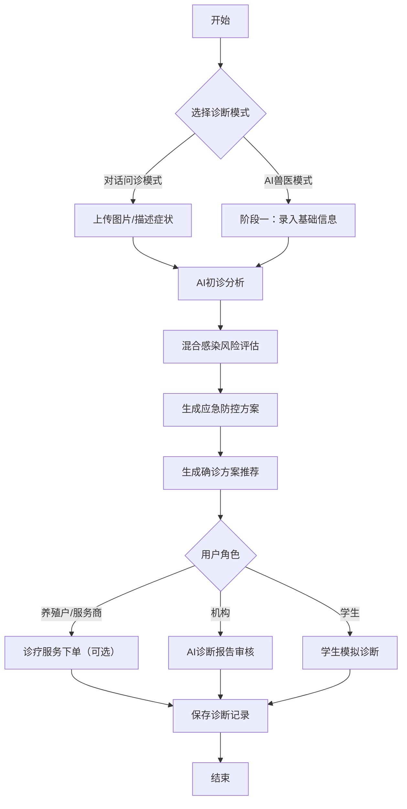
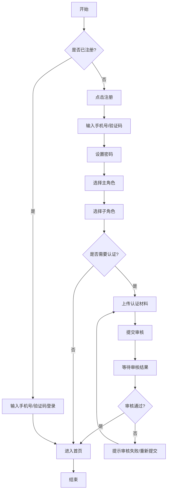

# 业务需求调研记录

## 1. 访谈纪要

### 1.1 访谈基本信息
| 访谈编号 | 访谈日期 | 访谈对象 | 职务/角色 | 访谈方式 | 访谈人员 |
|----------|----------|----------|-----------|----------|----------|
|          |          |          |           |          |          |

### 1.2 访谈内容记录
| 主题 | 访谈问题 | 访谈对象回答 | 关键需求点 | 优先级 |
|------|----------|--------------|------------|--------|
|      |          |              |            |        |

### 1.3 访谈总结
- 核心需求：
- 重要发现：
- 后续行动：

## 2. 需求收集表

| 需求编号 | 需求名称 | 需求描述 | 适用角色 | 优先级 | 来源 | 状态 |
|----------|----------|----------|----------|--------|------|------|
|          |          |          |          |        |      |      |

### 2.1 需求优先级定义
- **P0**：必须实现的核心需求，直接影响产品可用性
- **P1**：重要需求，影响产品核心功能体验
- **P2**：次要需求，可在后续版本实现
- **P3**：优化需求，提升产品体验

### 2.2 需求状态定义
- **待分析**：刚收集到的需求，尚未进行分析
- **已分析**：已完成需求分析，明确了需求细节
- **已确认**：需求已确认，可进入设计阶段
- **已拒绝**：需求不符合产品定位或技术可行性，已拒绝
- **已延期**：需求延期到后续版本实现

## 3. 业务流程图

### 3.1 流程图符号说明
| 符号 | 含义 |
|------|------|
| 圆角矩形 | 开始/结束 |
| 矩形 | 流程步骤 |
| 菱形 | 决策点 |
| 箭头 | 流程方向 |
| 平行四边形 | 数据输入/输出 |
| 椭圆形 | 注释 |

### 3.2 核心业务流程图模板

#### 3.2.1 AI诊断核心业务流程

#### 3.2.2 用户注册/登录流程

## 4. 调研结论与建议

### 4.1 核心需求总结
- 

### 4.2 业务流程优化建议
- 

### 4.3 功能需求补充建议
- 

### 4.4 非功能需求建议
- 