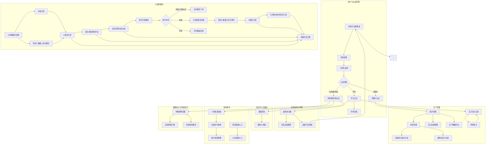

# 功能需求分析

## 1. 功能模块图

### 1.1 核心功能模块关系图


## 2. 用例图

### 2.1 用户与认证管理用例图
```mermaid
use case
    actor User
    actor System
    
    User --> (手机号注册/登录)
    User --> (角色选择)
    User --> (子角色选择)
    User --> (养殖户认证)
    User --> (学生认证)
    User --> (机构/服务商认证)
    User --> (导师关联)
    User --> (体验模式入口)
    
    (手机号注册/登录) --> System
    (角色选择) --> System
    (子角色选择) --> System
    (养殖户认证) --> System
    (学生认证) --> System
    (机构/服务商认证) --> System
    (导师关联) --> System
    (体验模式入口) --> System
```

### 2.2 AI诊断模块用例图
```mermaid
use case
    actor User
    actor AI System
    
    User --> (AI诊断模式选择)
    User --> (对话问诊)
    User --> (阶段一数据上传与整合)
    User --> (阶段二数据上传与整合)
    User --> (AI诊断报告审核)
    User --> (诊疗服务下单)
    User --> (学生模拟诊断)
    User --> (诊断历史记录)
    
    (对话问诊) --> AI System
    (阶段一数据上传与整合) --> AI System
    (阶段二数据上传与整合) --> AI System
    
    AI System --> (AI初诊分析)
    AI System --> (混合感染风险评估)
    AI System --> (应急防控方案生成)
    AI System --> (AI确诊分析)
    AI System --> (生物安全体系优化方案)
    AI System --> (确诊方案推荐)
```

## 3. 用户故事

### 3.1 用户与认证管理
| ID | 用户故事 | 验收标准 |
|----|----------|----------|
| US-USER-001 | 作为新用户，我希望能通过手机号注册，以便快速开始使用应用 | 1. 支持手机号+验证码注册<br>2. 注册流程简洁，不超过3步<br>3. 注册成功后自动登录 |
| US-USER-002 | 作为已有用户，我希望能通过手机号和密码登录，以便快速访问应用 | 1. 支持手机号+密码登录<br>2. 支持验证码快捷登录<br>3. 登录失败时给出明确提示 |
| US-USER-003 | 作为新注册用户，我希望能选择合适的角色，以便获得个性化的功能体验 | 1. 支持选择主角色（养殖户、机构、学生）<br>2. 根据主角色自动显示对应的子角色选项<br>3. 角色选择后可在设置中修改 |
| US-USER-004 | 作为养殖企业用户，我希望能完成企业认证，以便解锁高级功能 | 1. 支持上传营业执照等认证材料<br>2. 认证状态实时显示<br>3. 认证通过后自动解锁高级功能 |

### 3.2 AI诊断模块
| ID | 用户故事 | 验收标准 |
|----|----------|----------|
| US-AI-001 | 作为养殖户，我希望能通过对话方式描述症状并上传图片，以便快速获得AI初步诊断建议 | 1. 支持文字描述和图片上传<br>2. 支持多轮对话<br>3. 5秒内返回初步诊断结果 |
| US-AI-002 | 作为养殖户，我希望能通过标准化流程录入信息，以便获得更准确的AI诊断结果 | 1. 支持分阶段录入信息<br>2. 提供表单验证和提示<br>3. 支持保存草稿 |
| US-AI-003 | 作为养殖户，我希望能查看AI生成的应急防控方案，以便及时采取措施 | 1. 方案包含紧急控制、短期治疗、生物安全措施<br>2. 方案按时间线清晰展示<br>3. 支持方案下载和分享 |
| US-AI-004 | 作为科研院所用户，我希望能审核AI诊断报告，以便提高报告准确性 | 1. 支持查看完整诊断数据<br>2. 支持修改和批注报告<br>3. 审核结果实时反馈给用户 |
| US-AI-005 | 作为学生，我希望能进行模拟诊断并获得AI反馈，以便提升诊断技能 | 1. 提供真实病例数据<br>2. 支持学生提交诊断结果<br>3. AI给出评分和详细反馈 |

### 3.3 生产管理
| ID | 用户故事 | 验收标准 |
|----|----------|----------|
| US-PROD-001 | 作为养殖企业用户，我希望能创建和管理养殖批次，以便统一管理不同批次的禽只 | 1. 支持创建、编辑、删除批次<br>2. 批次信息包含品种、数量、入栏日期等<br>3. 支持按批次查看相关数据 |
| US-PROD-002 | 作为养殖企业用户，我希望能记录每日死淘数量，以便分析死淘率变化 | 1. 支持快速录入死淘数量<br>2. 自动计算死淘率<br>3. 生成死淘率曲线图 |
| US-PROD-003 | 作为养殖企业用户，我希望能记录每日耗料量，以便优化饲料使用 | 1. 支持录入耗料量<br>2. 生成耗料分析报告<br>3. 支持耗料量预测 |
| US-PROD-004 | 作为养殖企业用户，我希望能为员工分配不同权限，以便精细化管理 | 1. 支持创建不同角色和权限<br>2. 支持为员工分配角色<br>3. 权限变更实时生效 |

### 3.4 疫情监测与预警
| ID | 用户故事 | 验收标准 |
|----|----------|----------|
| US-EPID-001 | 作为疫控机构用户，我希望能查看疫情热力图，以便直观了解疫情分布 | 1. 实时更新疫情数据<br>2. 支持按地区、时间筛选<br>3. 热力图颜色渐变直观反映疫情严重程度 |
| US-EPID-002 | 作为疫控机构用户，我希望能接收异常高发报警，以便及时采取防控措施 | 1. 支持设置报警阈值<br>2. 异常情况实时推送通知<br>3. 报警信息包含详细数据和建议 |
| US-EPID-003 | 作为疫控机构用户，我希望能下发防疫政策和通知，以便及时传达给相关用户 | 1. 支持编辑和发布通知<br>2. 支持按地区、角色定向发送<br>3. 查看通知阅读情况 |

### 3.5 知识学习与题库
| ID | 用户故事 | 验收标准 |
|----|----------|----------|
| US-KNOW-001 | 作为用户，我希望能浏览禽类病理图谱，以便学习和参考 | 1. 支持按疾病类型分类浏览<br>2. 图谱包含疾病名称、症状描述、图片等<br>3. 支持搜索和收藏功能 |
| US-KNOW-002 | 作为学生，我希望能进行知识闯关测验，以便巩固理论知识 | 1. 支持多种题型（单选、多选、判断）<br>2. 自动批改并给出分数<br>3. 支持查看错题解析 |

### 3.6 商业服务
| ID | 用户故事 | 验收标准 |
|----|----------|----------|
| US-BUS-001 | 作为服务商，我希望能基于AI诊断结果进行精准广告投放，以便提高广告效果 | 1. 支持按诊断结果、用户角色定向投放<br>2. 提供广告效果统计<br>3. 支持广告素材管理 |
| US-BUS-002 | 作为服务商，我希望能接收在线诊疗请求并接单，以便提供专业服务 | 1. 实时接收诊疗请求通知<br>2. 支持查看请求详情和关联诊断记录<br>3. 支持接单、拒绝和转单操作 |
| US-BUS-003 | 作为养殖户，我希望能在线下单诊疗服务，以便获得专业帮助 | 1. 支持选择服务商和服务类型<br>2. 支持查看服务商评价和资质<br>3. 订单状态实时更新 |

### 3.7 数据标注与科研协作
| ID | 用户故事 | 验收标准 |
|----|----------|----------|
| US-RESEARCH-001 | 作为科研院所用户，我希望能标记特殊病例，以便进行深入研究 | 1. 支持浏览和筛选诊断记录<br>2. 支持标记特殊病例并添加标签<br>3. 支持按标签搜索病例 |
| US-RESEARCH-002 | 作为科研院所用户，我希望能下载高清原始图片，以便进行分析 | 1. 支持查看诊断所用原始图片<br>2. 支持批量下载图片<br>3. 下载记录可追溯 |
| US-RESEARCH-003 | 作为科研院所用户，我希望能创建科研协作群组，以便共享数据和研究成果 | 1. 支持创建和管理群组<br>2. 支持邀请成员加入<br>3. 支持在群组内共享数据和讨论 |

## 4. 功能需求清单

### 4.1 用户与认证管理 (F-USER_AUTH)
| 功能ID | 功能名称 | 功能描述 | 优先级 | 适用角色 |
|--------|---------|---------|--------|----------|
| F-USER_AUTH_001 | 手机号注册/登录 | 用户通过手机号接收验证码完成注册和登录，也可用手机号和注册时设置的登录密码登录。 | P0 | 所有角色 |
| F-USER_AUTH_002 | 角色选择 | 新用户注册时，引导选择“养殖户”、“机构”、“学生”等主角色。 | P0 | 新用户 |
| F-USER_AUTH_003 | 子角色选择 | 根据主角色选择，进一步选择细分类型（如小散户、养殖企业、疫控机构、学习阶段学生等）。 | P0 | 新用户 |
| F-USER_AUTH_004 | 养殖户认证 | 养殖企业/合作社用户需上传营业执照进行认证，审核通过后解锁高级功能。 | P0 | 养殖户（企业/合作社） |
| F-USER_AUTH_005 | 学生认证 | 学生用户需绑定学校/学号，并可输入导师邀请码加入实习组。 | P0 | 学生 |
| F-USER_AUTH_006 | 机构/服务商认证 | 机构（疫控机构、科研院所）/服务商用户需上传兽医资格证（教师资格证）、经营许可证等进行人工审核。 | P0 | 机构（政府疫控人员、科研机构研究人员或高校教师）/服务商 |
| F-USER_AUTH_007 | 导师关联 | 学生用户通过导师邀请码与导师账号关联，导师可查看学生实习数据。 | P0 | 学生、教师 |
| F-USER_AUTH_008 | 体验模式入口 | 未登录用户可通过"体验APP"按钮进入角色体验模式，无需注册登录。 | P1 | 未登录用户 |
| F-USER_AUTH_009 | 体验次数限制 | 每个设备每天最多可体验10次不同角色，每次体验时长不超过24小时，最多可体验15天。 | P1 | 未登录用户 |

### 4.2 AI诊断模块 (F-AI_DIAGNOSIS)
| 功能ID | 功能名称 | 功能描述 | 优先级 | 适用角色 |
|--------|---------|---------|--------|----------|
| F-AI_DIAGNOSIS_001 | AI诊断模式选择 | 支持用户选择AI诊断模式：对话问诊模式或AI兽医模式。 | P0 | 所有角色 |
| F-AI_DIAGNOSIS_002 | 对话问诊 | 支持用户通过文字描述症状、上传图片，与AI进行多轮对话，获取初步诊断建议。 | P0 | 所有角色 |
| F-AI_DIAGNOSIS_003 | 阶段一数据上传与整合 | 支持用户标准化录入养殖基础信息、临床表现，系统自动完成数据校验与结构化整合。 | P0 | 养殖户、学生（实习）、机构（科研院所）、机构（服务商） |
| F-AI_DIAGNOSIS_004 | 阶段二数据上传与整合 | 支持用户标准化录入病理变化、快速检测结果、采样信息及实验数据，系统自动完成数据校验与结构化整合。 | P0 | 机构（科研院所）、机构（服务商） |
| F-AI_DIAGNOSIS_005 | AI初诊分析 | 基于基础信息、临床表现，通过算法模型匹配病原特征、判定混合感染类型及风险等级，生成带置信度的初诊结论。 | P0 | 所有角色 |
| F-AI_DIAGNOSIS_006 | AI确诊分析 | 基于完整数据（基础信息、临床表现、病理变化、快速检测结果、采样信息及实验数据），通过算法模型进行综合分析，生成确诊结论。 | P0 | 机构（科研院所）、机构（服务商） |
| F-AI_DIAGNOSIS_007 | 混合感染风险评估 | 评估不同病原组合的混合感染风险，识别高风险组合及继发感染可能性，按风险等级排序。 | P0 | 所有角色 |
| F-AI_DIAGNOSIS_008 | 应急防控方案生成 | 基于诊断结论，按"紧急控制-短期治疗-生物安全"三个维度，生成分时段、分场景的标准化防控方案。 | P0 | 所有角色 |
| F-AI_DIAGNOSIS_009 | 生物安全体系优化方案 | 基于诊断结论，生成针对性的生物安全体系优化方案。 | P0 | 所有角色 |
| F-AI_DIAGNOSIS_010 | 确诊方案推荐 | 基于初诊方向，推荐分层级的实验室检测方案。 | P0 | 所有角色 |
| F-AI_DIAGNOSIS_011 | 学生模拟诊断 | 学生用户在虚拟诊断模式下，先提交自己的诊断判断，再查看AI结果进行比对学习。 | P0 | 学生（学习/实习） |
| F-AI_DIAGNOSIS_012 | 诊断历史记录 | 记录用户所有诊断历史，包括完整数据、分析过程和方案，方便查阅和管理。 | P0 | 所有角色 |
| F-AI_DIAGNOSIS_013 | AI诊断报告审核 | 支持专业人员（科研院所、服务商）审核和修订AI诊断报告。 | P0 | 机构（科研院所）、机构（服务商） |
| F-AI_DIAGNOSIS_014 | 诊疗服务下单 | 支持用户基于AI初诊报告下单诊疗服务，选择科研院所或服务商相关人员/团队。 | P0 | 养殖户、机构（服务商）、机构（科研院所） |
| F-AI_DIAGNOSIS_015 | 实验数据管理 | 支持用户上传和管理相关的实验室诊断项目的数据。 | P0 | 机构（科研院所）、机构（服务商） |

### 4.3 生产管理 (F-PRODUCTION_MANAGE)
| 功能ID | 功能名称 | 功能描述 | 优先级 | 适用角色 |
|--------|---------|---------|--------|----------|
| F-PRODUCTION_MANAGE_001 | 批次管理 | 养殖企业用户可创建和管理养殖批次，记录批次信息（品种、数量、入栏日期等）。 | P0 | 养殖户（企业/合作社） |
| F-PRODUCTION_MANAGE_002 | 存栏管理 | 记录各批次禽只的实时存栏数量。 | P0 | 养殖户（企业/合作社） |
| F-PRODUCTION_MANAGE_003 | 死淘率记录与分析 | 记录每日死淘数量，自动计算死淘率，并生成死淘率曲线图。 | P0 | 养殖户（企业/合作社） |
| F-PRODUCTION_MANAGE_004 | 耗料记录与分析 | 记录每日饲料消耗量，生成耗料分析报告。 | P0 | 养殖户（企业/合作社） |
| F-PRODUCTION_MANAGE_005 | 员工权限管理 | 养殖企业用户可为场长、饲养员等不同角色分配不同的系统操作权限。 | P0 | 养殖户（企业/合作社） |
| F-PRODUCTION_MANAGE_006 | 生产数据导出 | 养殖企业用户可将生产数据导出为Excel格式。 | P0 | 养殖户（企业/合作社） |
| F-PRODUCTION_MANAGE_007 | 实习日志记录 | 学生用户可拍照记录现场病例，填写实习日志，并生成实习报告。 | P0 | 学生（实习） |
| F-PRODUCTION_MANAGE_008 | 导师批注 | 导师用户可对学生提交的实习日志和报告进行远程批注和指导。 | P0 | 教师 |

### 4.4 疫情监测与预警 (F-EPIDEMIC_MONITOR)
| 功能ID | 功能名称 | 功能描述 | 优先级 | 适用角色 |
|--------|---------|---------|--------|----------|
| F-EPIDEMIC_MONITOR_001 | 疫情热力图 | 疫控机构用户可查看基于用户上传坐标生成的疾病热力图，直观展示疫情分布。 | P0 | 机构（疫控）、机构（科研院所） |
| F-EPIDEMIC_MONITOR_002 | 异常高发报警 | 系统自动识别异常高发区域或疾病，并向疫控机构用户发送报警通知。 | P0 | 机构（疫控） |
| F-EPIDEMIC_MONITOR_003 | 政策下发通道 | 疫控机构用户可通过平台向指定区域或用户群体下发防疫政策和通知。 | P0 | 机构（疫控） |

### 4.5 知识学习与题库 (F-KNOWLEDGE_LEARN)
| 功能ID | 功能名称 | 功能描述 | 优先级 | 适用角色 |
|--------|---------|---------|--------|----------|
| F-KNOWLEDGE_LEARN_001 | 图谱百科 | 提供禽类典型病理图谱的浏览功能，包含疾病名称、症状描述、图片等。 | P0 | 所有角色 |
| F-KNOWLEDGE_LEARN_002 | 题库与测验 | 提供禽病知识闯关测验，学生用户可进行在线答题，巩固理论知识。 | P0 | 学生（学习） |

### 4.6 商业服务 (F-BUSINESS_SERVICE)
| 功能ID | 功能名称 | 功能描述 | 优先级 | 适用角色 |
|--------|---------|---------|--------|----------|
| F-BUSINESS_SERVICE_001 | 广告精准投放 | 服务商用户可基于AI诊断结果和用户画像进行兽药、饲料、疫苗等产品的精准广告投放。 | P0 | 机构（服务商） |
| F-BUSINESS_SERVICE_002 | 在线诊疗接单 | 服务商用户可接收养殖户的在线诊疗请求并进行接单处理。 | P0 | 机构（服务商） |
| F-BUSINESS_SERVICE_003 | 客户档案管理 | 服务商用户可管理客户档案，记录客户养殖情况、历史订单等信息。 | P0 | 机构（服务商） |
| F-BUSINESS_SERVICE_004 | 兽药商城入口 | 为养殖户提供兽药、饲料、疫苗等产品的在线购买入口。 | P0 | 养殖户 |
| F-BUSINESS_SERVICE_005 | 大宗采购入口 | 为养殖企业提供大宗兽药、饲料、疫苗等产品的在线采购入口。 | P0 | 养殖户（企业/合作社） |

### 4.7 数据标注与科研协作 (F-DATA_ANNOTATION)
| 功能ID | 功能名称 | 功能描述 | 优先级 | 适用角色 |
|--------|---------|---------|--------|----------|
| F-DATA_ANNOTATION_001 | 特殊病例采集 | 科研院所用户可标记和采集系统中的特殊病例数据。 | P0 | 机构（科研院所） |
| F-DATA_ANNOTATION_002 | 高清原图下载 | 科研院所用户在获得授权后，可下载AI诊断所用的高清原始图片。 | P0 | 机构（科研院所） |
| F-DATA_ANNOTATION_003 | 科研协作群组 | 科研院所用户可创建和管理科研协作群组，共享数据和研究成果。 | P0 | 机构（科研院所） |
