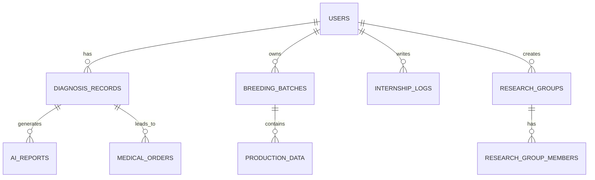

# 数据库详细设计

## 1. 引言

### 1.1 文档目的
本文档详细描述了禽康智检APP的数据库设计，包括表结构、字段定义、关系图、约束条件及初始化脚本，旨在为开发团队提供明确的数据库开发指导，确保数据库设计符合需求和质量标准。

### 1.2 文档范围
本文档涵盖了禽康智检APP的所有数据库表设计，包括用户表、诊断记录表、养殖批次表等。

### 1.3 术语定义
| 术语 | 定义 |
|------|------|
| MongoDB | 一种非关系型数据库 |
| 集合 | MongoDB中的数据集合，类似于关系型数据库中的表 |
| 文档 | MongoDB中的数据记录，类似于关系型数据库中的行 |
| 字段 | MongoDB文档中的属性，类似于关系型数据库中的列 |
| 索引 | 用于加速数据库查询的特殊数据结构 |
| 主键 | 唯一标识文档的字段 |
| 外键 | 关联其他集合文档的字段 |

## 2. 数据库设计原则

### 2.1 非关系型数据库设计原则
- 采用文档型数据模型，适合存储半结构化和非结构化数据
- 集合设计遵循业务需求，避免过度规范化
- 字段设计简洁明了，避免冗余数据
- 索引设计基于查询需求，提高查询性能
- 数据安全考虑，敏感数据加密存储

### 2.2 命名规范
- 集合名称：使用复数形式，如`users`、`diagnosis_records`
- 字段名称：使用驼峰命名法，如`phoneNumber`、`diagnosisTime`
- 索引名称：使用`idx_`前缀，如`idx_phone_number`

### 2.3 数据类型
- String：字符串类型，用于存储文本数据
- Number：数值类型，用于存储数字数据
- Date：日期类型，用于存储日期和时间
- Boolean：布尔类型，用于存储true/false值
- Array：数组类型，用于存储多个值
- Object：对象类型，用于存储嵌套数据结构
- ObjectId：对象ID，用于唯一标识文档

## 3. 数据库关系图



## 4. 集合设计

### 4.1 用户表 (users)

#### 4.1.1 表结构

| 字段名 | 数据类型 | 约束 | 描述 |
|--------|----------|------|------|
| _id | ObjectId | PK | 用户唯一标识 |
| phoneNumber | String | Unique, Not Null | 手机号 |
| passwordHash | String | Not Null | 密码哈希值 |
| nickname | String | | 昵称 |
| roleType | String | Not Null | 角色类型：FARMER, INSTITUTION, STUDENT, TEACHER |
| subRole | String | Not Null | 子角色类型 |
| organizationId | ObjectId | FK | 所属组织ID |
| authStatus | String | Not Null, Default: "UNVERIFIED" | 认证状态：UNVERIFIED, PENDING, VERIFIED |
| registrationDate | Date | Not Null, Default: Current Date | 注册日期 |
| lastLoginDate | Date | | 最后登录日期 |
| schoolId | String | | 学校ID（学生角色） |
| studentId | String | | 学号（学生角色） |
| mentorId | ObjectId | FK | 导师ID（学生角色） |
| certMaterials | Object | | 认证材料 |
| createdAt | Date | Not Null, Default: Current Date | 文档创建时间 |
| updatedAt | Date | Not Null, Default: Current Date | 文档更新时间 |

#### 4.1.2 索引设计

| 索引名称 | 索引字段 | 索引类型 | 用途 |
|----------|----------|----------|------|
| idx_phone_number | phoneNumber | 唯一索引 | 加速手机号查询 |
| idx_role_type | roleType | 普通索引 | 加速角色类型查询 |
| idx_auth_status | authStatus | 普通索引 | 加速认证状态查询 |

#### 4.1.3 示例文档

```json
{
  "_id": ObjectId("60d5ec49f1a2c8001c8e4b2a"),
  "phoneNumber": "13800138000",
  "passwordHash": "$2a$10$EixZaYVK1fsbw1ZfbX3OXePaWxn96p36WQoeG6Lruj3vjPGga31lW",
  "nickname": "用户123",
  "roleType": "FARMER",
  "subRole": "SMALL",
  "authStatus": "UNVERIFIED",
  "registrationDate": ISODate("2025-12-14T10:00:00Z"),
  "lastLoginDate": ISODate("2025-12-14T10:00:00Z"),
  "createdAt": ISODate("2025-12-14T10:00:00Z"),
  "updatedAt": ISODate("2025-12-14T10:00:00Z")
}
```

### 4.2 诊断记录表 (diagnosis_records)

#### 4.2.1 表结构

| 字段名 | 数据类型 | 约束 | 描述 |
|--------|----------|------|------|
| _id | ObjectId | PK | 诊断记录唯一标识 |
| userId | ObjectId | FK, Not Null | 用户ID |
| diagnosisTime | Date | Not Null, Default: Current Date | 诊断时间 |
| diagnosisMode | String | Not Null | 诊断模式：CHAT, VET |
| basicInfo | Object | | 基础养殖信息 |
| clinicalSymptoms | Object | | 临床表现 |
| pathologicalChanges | Object | | 病理变化 |
| rapidTestResults | Object | | 快速检测结果 |
| samplingInfo | Object | | 采样信息 |
| experimentalData | Object | | 实验数据 |
| chatHistory | Array | | 对话历史（仅对话问诊模式） |
| singleDiagnosis | Object | | 单项病原诊断结果 |
| mixedInfectionRisk | Object | | 混合感染风险分级 |
| coreThreat | String | | 核心威胁提示 |
| emergencyMeasures | Object | | 应急防控方案 |
| diagnosisPlan | Object | | 确诊方案推荐 |
| finalDiagnosis | Object | | AI确诊结论报告 |
| emergencyPreventionPlan | Object | | 应急防治方案 |
| biosecurityOptimizationPlan | Object | | 生物安全体系优化方案 |
| location | String | | GPS坐标 |
| isSpecialCase | Boolean | Default: false | 是否被标记为特殊病例 |
| studentDiagnosisInput | String | | 学生模拟诊断输入 |
| mentorCommentId | ObjectId | FK | 关联导师批注ID |
| auditStatus | String | Default: "UNREVIEWED" | 报告审核状态：UNREVIEWED, REVIEWED, REVISED |
| auditorId | ObjectId | FK | 审核人ID |
| auditComments | String | | 审核意见 |
| images | Array | | 图片URL列表 |
| createdAt | Date | Not Null, Default: Current Date | 文档创建时间 |
| updatedAt | Date | Not Null, Default: Current Date | 文档更新时间 |

#### 4.2.2 索引设计

| 索引名称 | 索引字段 | 索引类型 | 用途 |
|----------|----------|----------|------|
| idx_user_id | userId | 普通索引 | 加速用户诊断记录查询 |
| idx_diagnosis_time | diagnosisTime | 普通索引 | 加速时间范围查询 |
| idx_diagnosis_mode | diagnosisMode | 普通索引 | 加速诊断模式查询 |
| idx_is_special_case | isSpecialCase | 普通索引 | 加速特殊病例查询 |
| idx_audit_status | auditStatus | 普通索引 | 加速审核状态查询 |

#### 4.2.3 示例文档

```json
{
  "_id": ObjectId("60d5ec49f1a2c8001c8e4b2b"),
  "userId": ObjectId("60d5ec49f1a2c8001c8e4b2a"),
  "diagnosisTime": ISODate("2025-12-14T10:00:00Z"),
  "diagnosisMode": "VET",
  "basicInfo": {
    "species": "白羽肉鸡",
    "age": "30天",
    "quantity": 10000,
    "farmType": "规模化养殖场"
  },
  "clinicalSymptoms": {
    "symptoms": ["呼吸困难", "鸡冠发紫", "死亡率高"],
    "mortalityRate": 0.05
  },
  "mixedInfectionRisk": {
    "riskLevel": "HIGH",
    "infectionCombinations": [
      {
        "pathogens": ["禽流感病毒 (H9N2)", "新城疫病毒"],
        "probability": 0.82
      }
    ],
    "coreThreat": "混合感染可能导致的核心威胁"
  },
  "emergencyMeasures": {
    "emergencyControl": ["紧急隔离", "全面消毒", "紧急免疫"],
    "shortTermTreatment": ["药物治疗", "加强监测"],
    "biosecurityMeasures": ["改进通风系统", "增加消毒通道"]
  },
  "location": "39.9042,116.4074",
  "isSpecialCase": false,
  "auditStatus": "UNREVIEWED",
  "createdAt": ISODate("2025-12-14T10:00:00Z"),
  "updatedAt": ISODate("2025-12-14T10:00:00Z")
}
```

### 4.3 养殖批次表 (breeding_batches)

#### 4.3.1 表结构

| 字段名 | 数据类型 | 约束 | 描述 |
|--------|----------|------|------|
| _id | ObjectId | PK | 批次ID |
| enterpriseId | ObjectId | FK, Not Null | 养殖企业用户ID |
| batchName | String | Not Null | 批次名称 |
| species | String | Not Null | 禽类品种 |
| initialQuantity | Number | Not Null | 初始数量 |
| currentQuantity | Number | Not Null | 当前存栏数量 |
| entryDate | Date | Not Null | 入栏日期 |
| expectedSlaughterDate | Date | | 预计出栏日期 |
| actualSlaughterDate | Date | | 实际出栏日期 |
| status | String | Not Null, Default: "ACTIVE" | 状态：ACTIVE, FINISHED |
| createdAt | Date | Not Null, Default: Current Date | 文档创建时间 |
| updatedAt | Date | Not Null, Default: Current Date | 文档更新时间 |

#### 4.3.2 索引设计

| 索引名称 | 索引字段 | 索引类型 | 用途 |
|----------|----------|----------|------|
| idx_enterprise_id | enterpriseId | 普通索引 | 加速企业批次查询 |
| idx_status | status | 普通索引 | 加速状态查询 |
| idx_entry_date | entryDate | 普通索引 | 加速入栏日期查询 |

#### 4.3.3 示例文档

```json
{
  "_id": ObjectId("60d5ec49f1a2c8001c8e4b2c"),
  "enterpriseId": ObjectId("60d5ec49f1a2c8001c8e4b2a"),
  "batchName": "20251214-001",
  "species": "白羽肉鸡",
  "initialQuantity": 10000,
  "currentQuantity": 9500,
  "entryDate": ISODate("2025-12-14T00:00:00Z"),
  "expectedSlaughterDate": ISODate("2026-01-14T00:00:00Z"),
  "status": "ACTIVE",
  "createdAt": ISODate("2025-12-14T10:00:00Z"),
  "updatedAt": ISODate("2025-12-14T10:00:00Z")
}
```

### 4.4 生产数据表 (production_data)

#### 4.4.1 表结构

| 字段名 | 数据类型 | 约束 | 描述 |
|--------|----------|------|------|
| _id | ObjectId | PK | 生产数据ID |
| batchId | ObjectId | FK, Not Null | 批次ID |
| recordDate | Date | Not Null | 记录日期 |
| deathCount | Number | Default: 0 | 死淘数量 |
| feedConsumption | Number | Default: 0 | 耗料量（kg） |
| waterConsumption | Number | Default: 0 | 耗水量（L） |
| temperature | Number | | 温度（℃） |
| humidity | Number | | 湿度（%） |
| note | String | | 备注 |
| recorderId | ObjectId | FK, Not Null | 记录员ID |
| createdAt | Date | Not Null, Default: Current Date | 文档创建时间 |
| updatedAt | Date | Not Null, Default: Current Date | 文档更新时间 |

#### 4.4.2 索引设计

| 索引名称 | 索引字段 | 索引类型 | 用途 |
|----------|----------|----------|------|
| idx_batch_id | batchId | 普通索引 | 加速批次生产数据查询 |
| idx_record_date | recordDate | 普通索引 | 加速时间范围查询 |
| idx_batch_record_date | [batchId, recordDate] | 复合索引 | 加速批次和时间范围组合查询 |

#### 4.4.3 示例文档

```json
{
  "_id": ObjectId("60d5ec49f1a2c8001c8e4b2d"),
  "batchId": ObjectId("60d5ec49f1a2c8001c8e4b2c"),
  "recordDate": ISODate("2025-12-14T00:00:00Z"),
  "deathCount": 50,
  "feedConsumption": 2000,
  "waterConsumption": 5000,
  "temperature": 25,
  "humidity": 60,
  "recorderId": ObjectId("60d5ec49f1a2c8001c8e4b2a"),
  "createdAt": ISODate("2025-12-14T10:00:00Z"),
  "updatedAt": ISODate("2025-12-14T10:00:00Z")
}
```

### 4.5 实习日志表 (internship_logs)

#### 4.5.1 表结构

| 字段名 | 数据类型 | 约束 | 描述 |
|--------|----------|------|------|
| _id | ObjectId | PK | 实习日志ID |
| studentId | ObjectId | FK, Not Null | 学生ID |
| mentorId | ObjectId | FK, Not Null | 导师ID |
| logDate | Date | Not Null | 日志日期 |
| content | String | Not Null | 实习内容 |
| caseImages | Array | | 病例图片URL列表 |
| studentDiagnosis | String | | 学生诊断 |
| aiReference | Object | | AI参考诊断 |
| mentorComment | String | | 导师评语 |
| gpsLocation | String | | 打卡地点 |
| status | String | Default: "SUBMITTED" | 状态：DRAFT, SUBMITTED, REVIEWED, APPROVED |
| createdAt | Date | Not Null, Default: Current Date | 文档创建时间 |
| updatedAt | Date | Not Null, Default: Current Date | 文档更新时间 |

#### 4.5.2 索引设计

| 索引名称 | 索引字段 | 索引类型 | 用途 |
|----------|----------|----------|------|
| idx_student_id | studentId | 普通索引 | 加速学生实习日志查询 |
| idx_mentor_id | mentorId | 普通索引 | 加速导师查看实习日志 |
| idx_log_date | logDate | 普通索引 | 加速时间范围查询 |
| idx_status | status | 普通索引 | 加速状态查询 |

#### 4.5.3 示例文档

```json
{
  "_id": ObjectId("60d5ec49f1a2c8001c8e4b2e"),
  "studentId": ObjectId("60d5ec49f1a2c8001c8e4b2f"),
  "mentorId": ObjectId("60d5ec49f1a2c8001c8e4b30"),
  "logDate": ISODate("2025-12-14T00:00:00Z"),
  "content": "今天学习了禽病的临床诊断方法，观察了病鸡的症状，学习了如何采集样本...",
  "caseImages": ["https://example.com/image1.jpg", "https://example.com/image2.jpg"],
  "studentDiagnosis": "初步诊断为禽流感",
  "aiReference": {
    "diagnosis": "禽流感",
    "confidence": 0.85
  },
  "mentorComment": "诊断思路清晰，但还需要结合更多实验室检测结果进行确诊",
  "gpsLocation": "39.9042,116.4074",
  "status": "REVIEWED",
  "createdAt": ISODate("2025-12-14T10:00:00Z"),
  "updatedAt": ISODate("2025-12-14T15:00:00Z")
}
```

### 4.6 AI报告表 (ai_reports)

#### 4.6.1 表结构

| 字段名 | 数据类型 | 约束 | 描述 |
|--------|----------|------|------|
| _id | ObjectId | PK | AI报告ID |
| diagnosisRecordId | ObjectId | FK, Not Null | 诊断记录ID |
| reportType | String | Not Null | 报告类型：PRELIMINARY, FINAL, RISK_ASSESSMENT, PREVENTION_PLAN |
| content | Object | Not Null | 报告内容 |
| confidence | Number | | 置信度（0-1） |
| createdAt | Date | Not Null, Default: Current Date | 文档创建时间 |
| updatedAt | Date | Not Null, Default: Current Date | 文档更新时间 |

#### 4.6.2 索引设计

| 索引名称 | 索引字段 | 索引类型 | 用途 |
|----------|----------|----------|------|
| idx_diagnosis_record_id | diagnosisRecordId | 普通索引 | 加速诊断记录关联的AI报告查询 |
| idx_report_type | reportType | 普通索引 | 加速报告类型查询 |

#### 4.6.3 示例文档

```json
{
  "_id": ObjectId("60d5ec49f1a2c8001c8e4b31"),
  "diagnosisRecordId": ObjectId("60d5ec49f1a2c8001c8e4b2b"),
  "reportType": "PRELIMINARY",
  "content": {
    "preliminaryDiagnosis": [
      {
        "disease": "禽流感",
        "confidence": 0.85,
        "symptoms": ["呼吸困难", "鸡冠发紫", "死亡率高"]
      },
      {
        "disease": "新城疫",
        "confidence": 0.65,
        "symptoms": ["呼吸困难", "神经症状", "死亡率高"]
      }
    ],
    "riskLevel": "HIGH",
    "emergencyMeasures": ["隔离病鸡", "消毒场地", "联系兽医"]
  },
  "confidence": 0.85,
  "createdAt": ISODate("2025-12-14T10:00:00Z"),
  "updatedAt": ISODate("2025-12-14T10:00:00Z")
}
```

## 5. 约束条件

### 5.1 主键约束
- 所有集合必须有一个`_id`字段作为主键
- `_id`字段类型为`ObjectId`

### 5.2 唯一约束
- `users`集合的`phoneNumber`字段必须唯一

### 5.3 非空约束
- 关键业务字段必须设置为非空，如`users`集合的`phoneNumber`、`passwordHash`、`roleType`字段

### 5.4 引用完整性约束
- 外键字段必须引用其他集合的主键
- 推荐使用MongoDB的引用机制（手动引用或DBRef）维护引用完整性

### 5.5 数据验证
- 字段值必须符合业务规则，如`users`集合的`roleType`字段只能是预定义的枚举值

## 6. 初始化脚本

### 6.1 创建集合和索引

```javascript
// 连接到MongoDB数据库
const mongoose = require('mongoose');
mongoose.connect('mongodb://localhost:27017/qinkangzhijian', { useNewUrlParser: true, useUnifiedTopology: true });

// 定义用户模式
const userSchema = new mongoose.Schema({
  phoneNumber: { type: String, unique: true, required: true },
  passwordHash: { type: String, required: true },
  nickname: { type: String },
  roleType: { type: String, required: true },
  subRole: { type: String, required: true },
  organizationId: { type: mongoose.Schema.Types.ObjectId, ref: 'Organizations' },
  authStatus: { type: String, default: 'UNVERIFIED' },
  registrationDate: { type: Date, default: Date.now },
  lastLoginDate: { type: Date },
  schoolId: { type: String },
  studentId: { type: String },
  mentorId: { type: mongoose.Schema.Types.ObjectId, ref: 'Users' },
  certMaterials: { type: Object },
  createdAt: { type: Date, default: Date.now },
  updatedAt: { type: Date, default: Date.now }
});

// 定义诊断记录模式
const diagnosisRecordSchema = new mongoose.Schema({
  userId: { type: mongoose.Schema.Types.ObjectId, ref: 'Users', required: true },
  diagnosisTime: { type: Date, default: Date.now },
  diagnosisMode: { type: String, required: true },
  basicInfo: { type: Object },
  clinicalSymptoms: { type: Object },
  pathologicalChanges: { type: Object },
  rapidTestResults: { type: Object },
  samplingInfo: { type: Object },
  experimentalData: { type: Object },
  chatHistory: { type: Array },
  singleDiagnosis: { type: Object },
  mixedInfectionRisk: { type: Object },
  coreThreat: { type: String },
  emergencyMeasures: { type: Object },
  diagnosisPlan: { type: Object },
  finalDiagnosis: { type: Object },
  emergencyPreventionPlan: { type: Object },
  biosecurityOptimizationPlan: { type: Object },
  location: { type: String },
  isSpecialCase: { type: Boolean, default: false },
  studentDiagnosisInput: { type: String },
  mentorCommentId: { type: mongoose.Schema.Types.ObjectId, ref: 'InternshipLogs' },
  auditStatus: { type: String, default: 'UNREVIEWED' },
  auditorId: { type: mongoose.Schema.Types.ObjectId, ref: 'Users' },
  auditComments: { type: String },
  images: { type: Array },
  createdAt: { type: Date, default: Date.now },
  updatedAt: { type: Date, default: Date.now }
});

// 定义养殖批次模式
const breedingBatchSchema = new mongoose.Schema({
  enterpriseId: { type: mongoose.Schema.Types.ObjectId, ref: 'Users', required: true },
  batchName: { type: String, required: true },
  species: { type: String, required: true },
  initialQuantity: { type: Number, required: true },
  currentQuantity: { type: Number, required: true },
  entryDate: { type: Date, required: true },
  expectedSlaughterDate: { type: Date },
  actualSlaughterDate: { type: Date },
  status: { type: String, default: 'ACTIVE' },
  createdAt: { type: Date, default: Date.now },
  updatedAt: { type: Date, default: Date.now }
});

// 定义生产数据模式
const productionDataSchema = new mongoose.Schema({
  batchId: { type: mongoose.Schema.Types.ObjectId, ref: 'BreedingBatches', required: true },
  recordDate: { type: Date, required: true },
  deathCount: { type: Number, default: 0 },
  feedConsumption: { type: Number, default: 0 },
  waterConsumption: { type: Number, default: 0 },
  temperature: { type: Number },
  humidity: { type: Number },
  note: { type: String },
  recorderId: { type: mongoose.Schema.Types.ObjectId, ref: 'Users', required: true },
  createdAt: { type: Date, default: Date.now },
  updatedAt: { type: Date, default: Date.now }
});

// 定义实习日志模式
const internshipLogSchema = new mongoose.Schema({
  studentId: { type: mongoose.Schema.Types.ObjectId, ref: 'Users', required: true },
  mentorId: { type: mongoose.Schema.Types.ObjectId, ref: 'Users', required: true },
  logDate: { type: Date, required: true },
  content: { type: String, required: true },
  caseImages: { type: Array },
  studentDiagnosis: { type: String },
  aiReference: { type: Object },
  mentorComment: { type: String },
  gpsLocation: { type: String },
  status: { type: String, default: 'SUBMITTED' },
  createdAt: { type: Date, default: Date.now },
  updatedAt: { type: Date, default: Date.now }
});

// 定义AI报告模式
const aiReportSchema = new mongoose.Schema({
  diagnosisRecordId: { type: mongoose.Schema.Types.ObjectId, ref: 'DiagnosisRecords', required: true },
  reportType: { type: String, required: true },
  content: { type: Object, required: true },
  confidence: { type: Number },
  createdAt: { type: Date, default: Date.now },
  updatedAt: { type: Date, default: Date.now }
});

// 创建索引
userSchema.index({ phoneNumber: 1 }, { unique: true });
userSchema.index({ roleType: 1 });
userSchema.index({ authStatus: 1 });

diagnosisRecordSchema.index({ userId: 1 });
diagnosisRecordSchema.index({ diagnosisTime: 1 });
diagnosisRecordSchema.index({ diagnosisMode: 1 });
diagnosisRecordSchema.index({ isSpecialCase: 1 });
diagnosisRecordSchema.index({ auditStatus: 1 });

breedingBatchSchema.index({ enterpriseId: 1 });
breedingBatchSchema.index({ status: 1 });
breedingBatchSchema.index({ entryDate: 1 });

productionDataSchema.index({ batchId: 1 });
productionDataSchema.index({ recordDate: 1 });
productionDataSchema.index({ batchId: 1, recordDate: 1 });

internshipLogSchema.index({ studentId: 1 });
internshipLogSchema.index({ mentorId: 1 });
internshipLogSchema.index({ logDate: 1 });
internshipLogSchema.index({ status: 1 });

aiReportSchema.index({ diagnosisRecordId: 1 });
aiReportSchema.index({ reportType: 1 });

// 创建模型
const User = mongoose.model('User', userSchema);
const DiagnosisRecord = mongoose.model('DiagnosisRecord', diagnosisRecordSchema);
const BreedingBatch = mongoose.model('BreedingBatch', breedingBatchSchema);
const ProductionData = mongoose.model('ProductionData', productionDataSchema);
const InternshipLog = mongoose.model('InternshipLog', internshipLogSchema);
const AIReport = mongoose.model('AIReport', aiReportSchema);

console.log('MongoDB schemas and indexes created successfully!');
```

### 6.2 插入初始数据

```javascript
// 插入初始数据脚本
const mongoose = require('mongoose');

// 连接到MongoDB数据库
mongoose.connect('mongodb://localhost:27017/qinkangzhijian', { useNewUrlParser: true, useUnifiedTopology: true });

// 导入模型
const User = require('./models/User');

// 初始用户数据
const initialUsers = [
  {
    phoneNumber: '13800138000',
    passwordHash: '$2a$10$EixZaYVK1fsbw1ZfbX3OXePaWxn96p36WQoeG6Lruj3vjPGga31lW', // password: 123456
    nickname: '管理员',
    roleType: 'INSTITUTION',
    subRole: 'ADMIN',
    authStatus: 'VERIFIED'
  },
  {
    phoneNumber: '13800138001',
    passwordHash: '$2a$10$EixZaYVK1fsbw1ZfbX3OXePaWxn96p36WQoeG6Lruj3vjPGga31lW', // password: 123456
    nickname: '养殖户1',
    roleType: 'FARMER',
    subRole: 'SMALL',
    authStatus: 'UNVERIFIED'
  },
  {
    phoneNumber: '13800138002',
    passwordHash: '$2a$10$EixZaYVK1fsbw1ZfbX3OXePaWxn96p36WQoeG6Lruj3vjPGga31lW', // password: 123456
    nickname: '学生1',
    roleType: 'STUDENT',
    subRole: 'LEARNING',
    authStatus: 'UNVERIFIED'
  }
];

// 插入初始用户
User.insertMany(initialUsers)
  .then(users => {
    console.log('Initial users inserted successfully:', users.length);
    mongoose.connection.close();
  })
  .catch(error => {
    console.error('Error inserting initial users:', error);
    mongoose.connection.close();
  });
```

## 7. 性能优化

### 7.1 索引优化
- 基于查询需求设计索引，避免不必要的索引
- 复合索引的字段顺序应基于查询频率和选择性
- 定期监控索引使用情况，删除不常用的索引

### 7.2 查询优化
- 避免全集合扫描，使用索引覆盖查询
- 限制返回字段，只返回需要的数据
- 使用分页查询，避免一次性返回大量数据
- 优化聚合查询，使用管道操作符提高效率

### 7.3 数据模型优化
- 嵌入频繁访问的关联数据，减少查询次数
- 使用引用存储不频繁访问的关联数据，避免文档过大
- 合理设计文档大小，避免超过16MB的文档限制

### 7.4 写入优化
- 使用批量写入操作，减少网络往返次数
- 避免频繁更新大文档，考虑使用部分更新
- 合理设置写入关注级别，平衡写入性能和数据安全性

## 8. 数据安全

### 8.1 敏感数据保护
- 密码使用bcrypt算法进行哈希存储
- 手机号、身份证号等敏感数据加密存储
- 访问敏感数据时进行权限检查

### 8.2 访问控制
- 基于角色的访问控制（RBAC）
- 最小权限原则，只授予必要的访问权限
- 定期审查访问权限，撤销不必要的权限

### 8.3 数据备份与恢复
- 定期备份数据库，使用MongoDB的备份工具
- 建立灾难恢复计划，确保数据可恢复
- 测试恢复流程，确保备份数据可用

### 8.4 审计与监控
- 记录数据库操作日志，便于审计和故障排查
- 监控数据库性能和安全事件
- 设置告警机制，及时发现异常情况

## 9. 结论

本文档详细描述了禽康智检APP的数据库设计，包括表结构、字段定义、关系图、约束条件及初始化脚本。数据库设计遵循非关系型数据库设计原则，考虑了性能优化和数据安全，进行了必要的索引设计和查询优化。通过遵循本文档的设计，将确保数据库开发符合需求和质量标准，实现预期的功能和性能目标。
