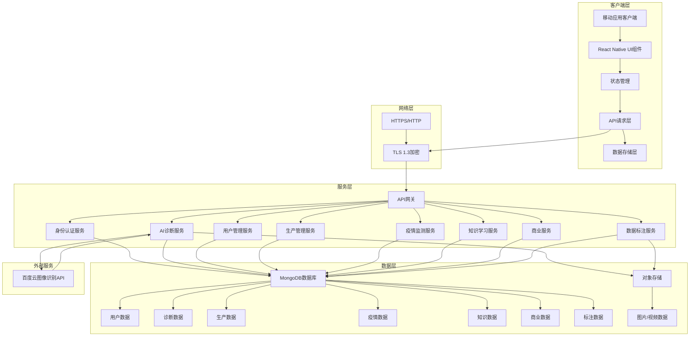

# 系统架构设计文档

## 1. 引言

### 1.1 文档目的
本文档详细描述了禽康智检APP的系统架构设计，包括前端架构、后端架构和数据库架构，旨在为开发团队提供明确的架构指导，确保系统开发符合需求和质量标准。

### 1.2 文档范围
本文档涵盖了禽康智检APP的整体架构设计，包括技术选型、架构图、模块划分、数据流程等内容。

### 1.3 术语定义
| 术语 | 定义 |
|------|------|
| React Native | 一种用于构建跨平台移动应用的JavaScript框架 |
| Expo | 一个基于React Native的开发平台，提供了一系列工具和服务 |
| Node.js | 一种基于Chrome V8引擎的JavaScript运行时环境 |
| Express | 一个基于Node.js的Web应用框架 |
| MongoDB | 一种非关系型数据库 |
| RESTful API | 一种软件架构风格，用于设计网络应用程序接口 |
| JWT | JSON Web Token，一种用于身份认证的令牌 |
| CI/CD | 持续集成/持续部署，一种软件开发实践 |

## 2. 系统整体架构

### 2.1 架构概述
禽康智检APP采用前后端分离的架构设计，前端使用React Native + Expo开发，后端使用Node.js + Express开发，数据库使用MongoDB。系统架构设计考虑了可扩展性、可维护性、安全性和性能要求。

### 2.2 架构图



## 3. 前端架构设计

### 3.1 技术选型

| 技术 | 版本 | 用途 |
|------|------|------|
| Expo SDK | 54.0.18 | 跨平台移动端开发与构建 |
| React Native | Expo内置 | 移动端UI框架 |
| TypeScript | 5.3.3 | 类型安全开发 |
| React Navigation | 6.1.18 | 应用导航 |
| React Context + useReducer | 内置 | 状态管理 |
| Axios | 最新稳定版 | API请求 |
| AsyncStorage | 最新稳定版 | 本地存储 |
| Tailwind CSS | 最新稳定版 | 样式设计与布局 |

### 3.2 架构设计

#### 3.2.1 组件设计
- **原子组件**：基础UI组件，如按钮、输入框、文本等
- **分子组件**：由多个原子组件组成的功能组件，如表单、列表项等
- **组织组件**：由多个分子组件组成的页面组件，如登录页、首页等

#### 3.2.2 状态管理
- **全局状态**：使用React Context + useReducer管理全局状态，如用户信息、主题设置等
- **局部状态**：使用React useState管理组件局部状态

#### 3.2.3 路由管理
- **Stack Navigation**：用于管理页面间的导航关系
- **Bottom Tab Navigation**：用于不同角色的底部导航栏

#### 3.2.4 API请求层
- 封装Axios实例，统一处理请求和响应
- 实现请求拦截器和响应拦截器
- 处理错误和异常

#### 3.2.5 数据存储层
- 使用AsyncStorage进行本地数据存储
- 实现数据缓存机制
- 处理数据的增删改查

### 3.3 模块划分

| 模块名称 | 功能描述 |
|----------|----------|
| 用户与认证模块 | 处理用户注册、登录、角色选择和认证 |
| AI诊断模块 | 提供AI诊断、风险评估、防控方案生成等功能 |
| 生产管理模块 | 实现批次管理、存栏管理、死淘率分析等功能 |
| 疫情监测与预警模块 | 提供疫情热力图、异常高发报警等功能 |
| 知识学习与题库模块 | 包含图谱百科、题库与测验等功能 |
| 商业服务模块 | 实现广告精准投放、在线诊疗接单等功能 |
| 数据标注与科研协作模块 | 提供特殊病例采集、高清原图下载等功能 |

## 4. 后端架构设计

### 4.1 技术选型

| 技术 | 版本 | 用途 |
|------|------|------|
| Node.js | 24.11.1 | 后端运行环境 |
| Express.js | 5.2.1 | Web框架 |
| MongoDB | 8.2.2 | 非关系型数据库 |
| Mongoose | 9.0.1 | MongoDB ODM |
| JWT | 最新稳定版 | 认证授权 |
| bcrypt | 最新稳定版 | 密码加密 |
| CORS | 最新稳定版 | 跨域支持 |
| dotenv | 最新稳定版 | 环境变量管理 |
| morgan | 最新稳定版 | 请求日志 |

### 4.2 架构设计

#### 4.2.1 服务划分
- **API网关**：统一管理API请求，处理身份认证、请求路由等
- **身份认证服务**：处理用户注册、登录、认证等功能
- **AI诊断服务**：处理AI诊断请求，调用百度云图像识别API
- **用户管理服务**：处理用户信息的增删改查
- **生产管理服务**：处理生产数据的录入和查询
- **疫情监测服务**：处理疫情数据的分析和展示
- **知识学习服务**：处理知识图谱和题库的管理
- **商业服务**：处理广告投放、在线诊疗接单等功能
- **数据标注服务**：处理特殊病例采集、高清原图下载等功能

#### 4.2.2 API设计
- 遵循RESTful设计规范
- 使用HTTP方法（GET, POST, PUT, DELETE）表示操作类型
- 使用JSON格式进行数据交换
- 实现API版本控制

#### 4.2.3 身份认证与授权
- 使用JWT进行身份认证
- 基于角色的访问控制（RBAC）
- API请求频率限制

#### 4.2.4 错误处理
- 统一的错误处理机制
- 明确的错误码定义
- 详细的错误日志

#### 4.2.5 日志管理
- 请求日志：记录所有API请求
- 错误日志：记录系统错误
- 业务日志：记录关键业务操作

### 4.3 模块划分

| 模块名称 | 功能描述 |
|----------|----------|
| 用户模块 | 处理用户注册、登录、认证等功能 |
| AI诊断模块 | 处理AI诊断请求，调用百度云图像识别API |
| 生产管理模块 | 处理生产数据的录入和查询 |
| 疫情监测模块 | 处理疫情数据的分析和展示 |
| 知识学习模块 | 处理知识图谱和题库的管理 |
| 商业服务模块 | 处理广告投放、在线诊疗接单等功能 |
| 数据标注模块 | 处理特殊病例采集、高清原图下载等功能 |
| 公共模块 | 包含工具函数、中间件等公共功能 |

## 5. 数据库架构设计

### 5.1 技术选型

| 技术 | 版本 | 用途 |
|------|------|------|
| MongoDB | 8.2.2 | 非关系型数据库 |
| Mongoose | 9.0.1 | MongoDB ODM |

### 5.2 数据模型设计

#### 5.2.1 用户模型 (Users)
```typescript
{
  user_id: String,          // 用户唯一标识
  phone_number: String,     // 手机号
  password_hash: String,    // 密码哈希值
  nickname: String,         // 昵称
  role_type: String,        // 角色类型：FARMER, INSTITUTION, STUDENT, TEACHER
  sub_role: String,         // 子角色类型
  organization_id: String,  // 所属组织ID
  auth_status: String,      // 认证状态：UNVERIFIED, PENDING, VERIFIED
  registration_date: Date,  // 注册日期
  last_login_date: Date,    // 最后登录日期
  school_id: String,        // 学校ID（学生角色）
  student_id: String,       // 学号（学生角色）
  mentor_id: String         // 导师ID（学生角色）
}
```

#### 5.2.2 诊断记录模型 (Diagnosis_Records)
```typescript
{
  record_id: String,                // 诊断记录唯一标识
  user_id: String,                  // 用户ID
  diagnosis_time: Date,             // 诊断时间
  diagnosis_mode: String,           // 诊断模式：CHAT, VET
  basic_info: Object,               // 基础养殖信息
  clinical_symptoms: Object,        // 临床表现
  pathological_changes: Object,     // 病理变化
  rapid_test_results: Object,       // 快速检测结果
  sampling_info: Object,            // 采样信息
  experimental_data: Object,        // 实验数据
  chat_history: Array,              // 对话历史（仅对话问诊模式）
  single_diagnosis: Object,         // 单项病原诊断结果
  mixed_infection_risk: Object,     // 混合感染风险分级
  core_threat: String,              // 核心威胁提示
  emergency_measures: Object,       // 应急防控方案
  diagnosis_plan: Object,           // 确诊方案推荐
  final_diagnosis: Object,          // AI确诊结论报告
  emergency_prevention_plan: Object, // 应急防治方案
  biosecurity_optimization_plan: Object, // 生物安全体系优化方案
  location: String,                 // GPS坐标
  is_special_case: Boolean,         // 是否被标记为特殊病例
  student_diagnosis_input: String,  // 学生模拟诊断输入
  mentor_comment_id: String,        // 关联导师批注ID
  audit_status: String,             // 报告审核状态：UNREVIEWED, REVIEWED, REVISED
  auditor_id: String,               // 审核人ID
  audit_comments: String            // 审核意见
}
```

#### 5.2.3 养殖批次模型 (Breeding_Batches)
```typescript
{
  batch_id: String,           // 批次ID
  enterprise_id: String,      // 养殖企业用户ID
  batch_name: String,         // 批次名称
  species: String,            // 禽类品种
  initial_quantity: Number,   // 初始数量
  entry_date: Date,           // 入栏日期
  current_quantity: Number,   // 当前存栏数量
  status: String              // 状态：ACTIVE, FINISHED
}
```

### 5.3 索引策略

| 集合名称 | 索引字段 | 索引类型 | 用途 |
|----------|----------|----------|------|
| Users | phone_number | 唯一索引 | 加速手机号查询 |
| Users | user_id | 主键索引 | 加速用户ID查询 |
| Diagnosis_Records | user_id | 普通索引 | 加速用户诊断记录查询 |
| Diagnosis_Records | diagnosis_time | 普通索引 | 加速时间范围查询 |
| Breeding_Batches | enterprise_id | 普通索引 | 加速企业批次查询 |
| Breeding_Batches | status | 普通索引 | 加速状态查询 |

### 5.4 数据安全
- 敏感数据（如密码、手机号）采用AES-256加密存储
- 数据库访问权限控制
- 定期数据备份

## 6. 关键技术难点及解决方案

### 6.1 AI诊断性能优化
- **问题**：AI诊断结果返回时间较长
- **解决方案**：
  - 图片压缩处理，减少传输时间
  - 异步处理AI诊断请求
  - 实现缓存机制，缓存相同图片的诊断结果

### 6.2 数据安全保障
- **问题**：用户敏感数据的安全存储和传输
- **解决方案**：
  - 采用TLS 1.3进行数据传输加密
  - 敏感数据加密存储
  - 实现API请求频率限制，防止暴力攻击

### 6.3 系统可扩展性
- **问题**：系统需要支持未来业务扩展
- **解决方案**：
  - 模块化设计，支持插件化扩展
  - API网关设计，方便添加新服务
  - 数据库设计考虑未来数据量增长

### 6.4 跨平台兼容性
- **问题**：需要兼容不同操作系统和设备
- **解决方案**：
  - 使用React Native + Expo开发，支持iOS和Android
  - 响应式设计，适配不同屏幕尺寸
  - 兼容性测试，确保在主流设备上正常运行

## 7. 部署架构设计

### 7.1 开发环境
- 前端：Expo开发环境
- 后端：Node.js开发环境
- 数据库：MongoDB本地实例

### 7.2 测试环境
- 前端：Expo测试环境
- 后端：云服务器
- 数据库：MongoDB Atlas M0

### 7.3 生产环境
- 前端：通过Expo Build Service构建的iOS和Android应用
- 后端：云服务器（4核8G）
- 数据库：MongoDB Atlas
- 对象存储：阿里云OSS/AWS S3

### 7.4 CI/CD流程
- 代码提交 → 自动构建 → 自动测试 → 自动部署
- 使用GitHub Actions实现CI/CD流水线

## 8. 架构评审要点

### 8.1 架构合规性
- 符合公司架构设计规范
- 遵循软件工程最佳实践

### 8.2 性能要求
- 响应时间符合需求
- 并发处理能力符合需求
- 数据处理能力符合需求

### 8.3 安全性要求
- 数据加密机制
- 身份认证与授权
- API安全防护

### 8.4 可扩展性要求
- 模块化设计
- API网关设计
- 数据库设计考虑未来扩展

### 8.5 可维护性要求
- 代码结构清晰
- 文档齐全
- 日志管理完善

## 9. 结论

本文档详细描述了禽康智检APP的系统架构设计，包括前端架构、后端架构和数据库架构。架构设计考虑了可扩展性、可维护性、安全性和性能要求，符合软件工程规范和公司架构设计规范。系统架构设计将为后续的详细设计和开发工作提供明确的指导，确保系统开发符合需求和质量标准。
