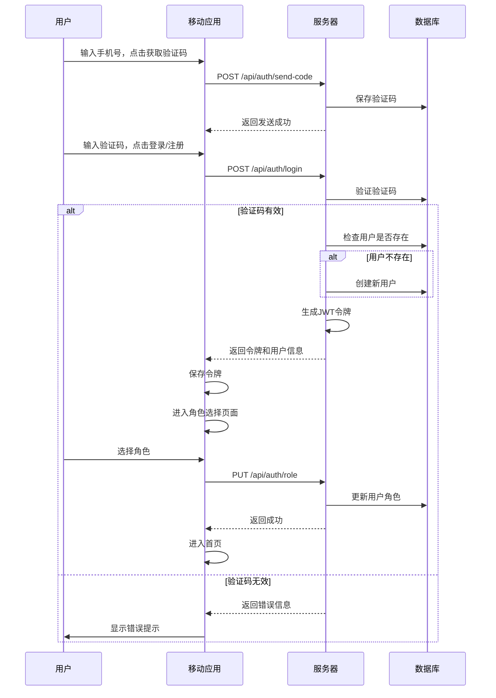
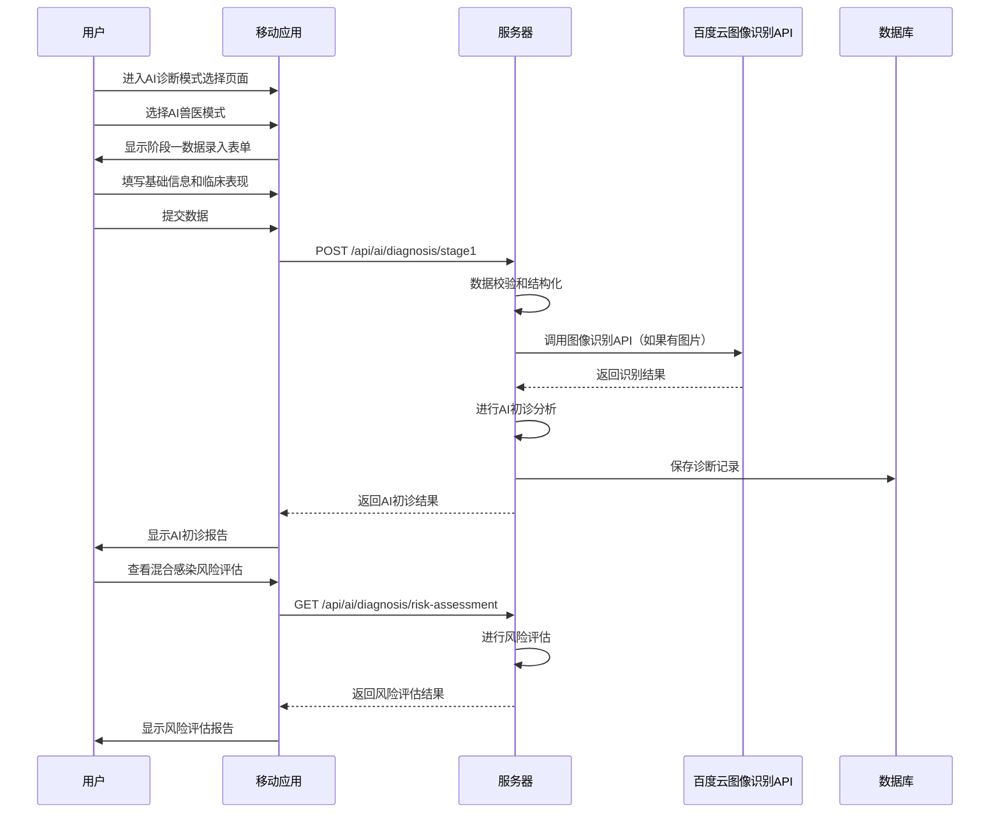
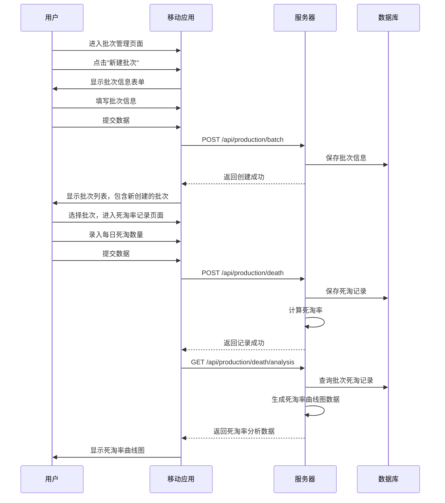
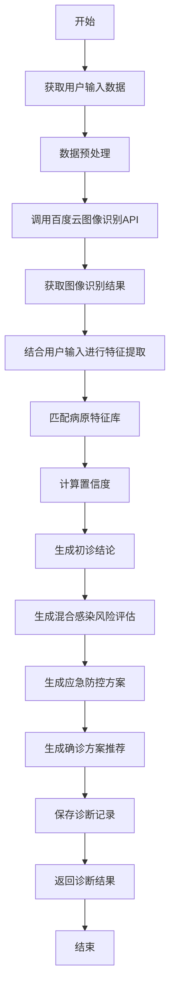
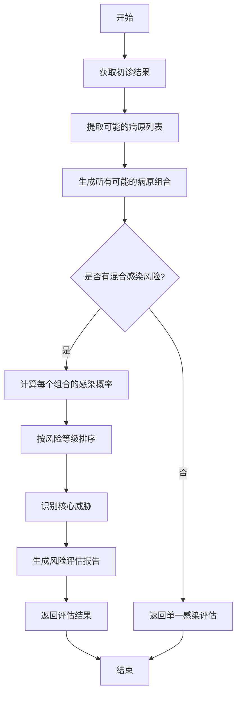
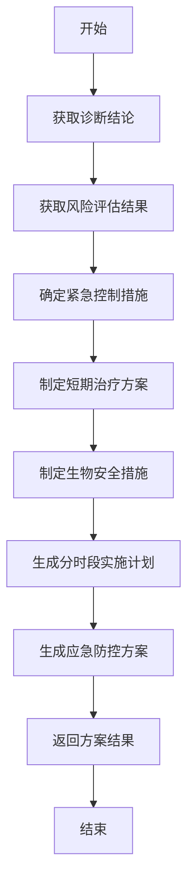

# 详细设计文档

## 1. 引言

### 1.1 文档目的
本文档详细描述了禽康智检APP各模块的功能实现细节、接口定义、数据流转逻辑，旨在为开发团队提供明确的开发指导，确保系统开发符合需求和质量标准。

### 1.2 文档范围
本文档涵盖了禽康智检APP的所有功能模块，包括用户与认证管理、AI诊断模块、生产管理、疫情监测与预警、知识学习与题库、商业服务、数据标注与科研协作等模块。

### 1.3 术语定义
| 术语 | 定义 |
|------|------|
| React Native | 一种用于构建跨平台移动应用的JavaScript框架 |
| Expo | 一个基于React Native的开发平台，提供了一系列工具和服务 |
| Node.js | 一种基于Chrome V8引擎的JavaScript运行时环境 |
| Express | 一个基于Node.js的Web应用框架 |
| MongoDB | 一种非关系型数据库 |
| RESTful API | 一种软件架构风格，用于设计网络应用程序接口 |
| JWT | JSON Web Token，一种用于身份认证的令牌 |
| RBAC | 基于角色的访问控制（Role-Based Access Control） |

## 2. 模块设计

### 2.1 用户与认证管理模块

#### 2.1.1 功能实现细节

##### 2.1.1.1 手机号注册/登录
- **功能描述**：用户通过手机号接收验证码完成注册和登录，也可用手机号和密码登录。
- **实现流程**：
  1. 用户输入手机号，点击获取验证码
  2. 系统发送验证码到用户手机
  3. 用户输入验证码，点击登录/注册
  4. 系统验证验证码，若有效则生成JWT令牌返回给用户

##### 2.1.1.2 角色选择
- **功能描述**：新用户注册时，引导选择主角色和子角色。
- **实现流程**：
  1. 用户注册成功后，进入角色选择页面
  2. 用户选择主角色（养殖户、机构、学生）
  3. 系统根据主角色显示对应的子角色选项
  4. 用户选择子角色，完成角色设置

##### 2.1.1.3 用户认证
- **功能描述**：不同角色用户提交认证材料进行身份验证。
- **实现流程**：
  1. 用户进入认证页面
  2. 系统根据用户角色显示对应的认证材料要求
  3. 用户上传认证材料
  4. 系统保存认证材料，更新认证状态为"待审核"
  5. 管理员审核认证材料，更新认证状态

#### 2.1.2 接口定义

| 接口名称 | 请求方法 | 请求路径 | 请求参数 | 返回结果 |
|----------|----------|----------|----------|----------|
| 发送验证码 | POST | /api/auth/send-code | phone_number | { success: boolean, message: string } |
| 手机号登录/注册 | POST | /api/auth/login | phone_number, code, password? | { token: string, user: object } |
| 密码登录 | POST | /api/auth/login/password | phone_number, password | { token: string, user: object } |
| 角色选择 | PUT | /api/auth/role | user_id, role_type, sub_role | { success: boolean, message: string } |
| 提交认证材料 | POST | /api/auth/certify | user_id, cert_materials | { success: boolean, message: string } |
| 获取认证状态 | GET | /api/auth/certify/status | user_id | { status: string, message: string } |

#### 2.1.3 数据流转逻辑

### 2.2 AI诊断模块

#### 2.2.1 功能实现细节

##### 2.2.1.1 对话问诊
- **功能描述**：用户通过文字描述症状、上传图片，与AI进行多轮对话，获取初步诊断建议。
- **实现流程**：
  1. 用户进入对话问诊页面
  2. 用户输入症状描述或上传图片
  3. 系统将用户输入发送到后端
  4. 后端调用百度云图像识别API（如果有图片）
  5. 后端进行AI诊断，生成诊断结果
  6. 系统将诊断结果返回给用户
  7. 用户可继续输入追问，系统进行多轮对话

##### 2.2.1.2 AI初诊分析
- **功能描述**：基于用户录入的基础信息、临床表现，生成带置信度的初诊结论。
- **实现流程**：
  1. 用户进入AI兽医模式，录入基础信息和临床表现
  2. 用户提交数据，系统将数据发送到后端
  3. 后端进行AI初诊分析，生成初诊结论
  4. 系统将初诊结论返回给用户
  5. 用户可查看详细的初诊报告，包括确诊建议方案

##### 2.2.1.3 混合感染风险评估
- **功能描述**：评估不同病原组合的混合感染风险，识别高风险组合及继发感染可能性。
- **实现流程**：
  1. 系统获取AI初诊结果
  2. 系统调用混合感染风险评估算法
  3. 算法分析不同病原组合的感染风险
  4. 系统生成风险评估报告，按风险等级排序

#### 2.2.2 接口定义

| 接口名称 | 请求方法 | 请求路径 | 请求参数 | 返回结果 |
|----------|----------|----------|----------|----------|
| 对话问诊 | POST | /api/ai/diagnosis/chat | user_id, message, images? | { response: object, chat_history: array } |
| 阶段一数据上传 | POST | /api/ai/diagnosis/stage1 | user_id, basic_info, clinical_symptoms | { diagnosis_result: object } |
| 阶段二数据上传 | POST | /api/ai/diagnosis/stage2 | user_id, pathological_changes, rapid_test_results, sampling_info, experimental_data | { final_diagnosis: object } |
| 获取诊断历史 | GET | /api/ai/diagnosis/history | user_id, page, limit | { records: array, total: number } |
| 审核诊断报告 | PUT | /api/ai/diagnosis/audit | record_id, auditor_id, audit_status, audit_comments | { success: boolean, message: string } |
| 下载高清原图 | GET | /api/ai/diagnosis/download-image | image_id | { file_url: string } |

#### 2.2.3 数据流转逻辑

### 2.3 生产管理模块

#### 2.3.1 功能实现细节

##### 2.3.1.1 批次管理
- **功能描述**：养殖企业用户创建和管理养殖批次，记录批次信息。
- **实现流程**：
  1. 用户进入批次管理页面
  2. 用户点击"新建批次"，填写批次信息
  3. 系统保存批次信息，创建新批次
  4. 用户可查看、编辑和删除批次

##### 2.3.1.2 死淘率记录与分析
- **功能描述**：记录每日死淘数量，自动计算死淘率，并生成死淘率曲线图。
- **实现流程**：
  1. 用户进入死淘率记录页面
  2. 用户选择批次，录入每日死淘数量
  3. 系统保存死淘记录
  4. 系统自动计算死淘率
  5. 系统生成死淘率曲线图，供用户查看

#### 2.3.2 接口定义

| 接口名称 | 请求方法 | 请求路径 | 请求参数 | 返回结果 |
|----------|----------|----------|----------|----------|
| 创建批次 | POST | /api/production/batch | enterprise_id, batch_name, species, initial_quantity, entry_date | { batch_id: string, message: string } |
| 获取批次列表 | GET | /api/production/batches | enterprise_id, page, limit | { batches: array, total: number } |
| 更新批次信息 | PUT | /api/production/batch | batch_id, batch_name?, species?, initial_quantity?, entry_date? | { success: boolean, message: string } |
| 删除批次 | DELETE | /api/production/batch | batch_id | { success: boolean, message: string } |
| 记录死淘数量 | POST | /api/production/death | batch_id, death_count, record_date | { success: boolean, message: string } |
| 获取死淘率分析 | GET | /api/production/death/analysis | batch_id, start_date, end_date | { death_rate_data: array, message: string } |
| 记录耗料量 | POST | /api/production/feed | batch_id, feed_consumption, record_date | { success: boolean, message: string } |
| 获取耗料分析 | GET | /api/production/feed/analysis | batch_id, start_date, end_date | { feed_analysis_data: array, message: string } |

#### 2.3.3 数据流转逻辑

## 3. 核心算法流程图

### 3.1 AI初诊分析算法

### 3.2 混合感染风险评估算法

### 3.3 应急防控方案生成算法

## 4. 异常处理

### 4.1 客户端异常处理

| 异常类型 | 处理方式 |
|----------|----------|
| 网络异常 | 显示网络连接错误提示，提供重试按钮 |
| 服务器异常 | 显示服务器错误提示，建议稍后重试 |
| 数据验证失败 | 显示具体的验证错误信息，指导用户修正 |
| 权限不足 | 显示权限不足提示，引导用户完成认证 |
| 操作超时 | 显示操作超时提示，提供重试按钮 |

### 4.2 服务器端异常处理

| 异常类型 | 处理方式 |
|----------|----------|
| 参数验证失败 | 返回400错误，包含具体的错误信息 |
| 身份认证失败 | 返回401错误，提示重新登录 |
| 权限不足 | 返回403错误，提示无操作权限 |
| 资源不存在 | 返回404错误，提示资源不存在 |
| 服务器内部错误 | 返回500错误，记录详细错误日志 |
| 第三方API调用失败 | 返回502错误，记录详细错误日志，实现重试机制 |

## 5. 部署与配置

### 5.1 开发环境配置

| 环境 | 配置内容 |
|------|----------|
| 前端开发环境 | Node.js 24.11.1, Expo CLI 6.3.11, React Native 0.81.5 |
| 后端开发环境 | Node.js 24.11.1, Express 5.2.1, MongoDB 8.2.2 |
| 数据库配置 | MongoDB本地实例，端口27017 |
| 开发工具 | VS Code, Git, Postman |

### 5.2 测试环境配置

| 环境 | 配置内容 |
|------|----------|
| 前端测试环境 | Expo TestFlight (iOS), Expo Go (Android) |
| 后端测试环境 | 云服务器，Node.js 24.11.1, Express 5.2.1 |
| 数据库配置 | MongoDB Atlas M0，连接字符串配置 |
| 测试工具 | Jest, React Testing Library, Postman |

### 5.3 生产环境配置

| 环境 | 配置内容 |
|------|----------|
| 前端生产环境 | 通过Expo Build Service构建的iOS和Android应用 |
| 后端生产环境 | 云服务器（4核8G），Node.js 24.11.1, Express 5.2.1 |
| 数据库配置 | MongoDB Atlas，连接字符串配置，数据库用户权限配置 |
| 对象存储配置 | 阿里云OSS/AWS S3，访问密钥配置 |
| 日志配置 | 集中式日志管理，定期日志备份 |
| 监控配置 | 系统监控，性能监控，异常告警 |

## 6. 代码规范

### 6.1 前端代码规范

- 遵循React Native最佳实践
- 使用TypeScript进行类型安全开发
- 组件命名采用PascalCase
- 函数命名采用camelCase
- 变量命名采用camelCase
- 使用ESLint进行代码质量检查
- 使用Prettier进行代码格式化

### 6.2 后端代码规范

- 遵循Node.js和Express最佳实践
- 使用TypeScript进行类型安全开发
- 路由命名采用RESTful风格
- 函数命名采用camelCase
- 变量命名采用camelCase
- 使用ESLint进行代码质量检查
- 使用Prettier进行代码格式化

## 7. 测试要点

### 7.1 功能测试

- 用户注册、登录功能测试
- 角色选择和认证功能测试
- AI诊断功能测试
- 生产管理功能测试
- 疫情监测功能测试
- 知识学习功能测试
- 商业服务功能测试
- 数据标注功能测试

### 7.2 性能测试

- AI诊断结果返回时间测试
- 页面加载时间测试
- 数据提交响应时间测试
- 并发用户测试

### 7.3 安全测试

- 身份认证测试
- 权限控制测试
- 数据加密测试
- API安全测试

### 7.4 兼容性测试

- iOS设备兼容性测试
- Android设备兼容性测试
- 不同屏幕尺寸兼容性测试
- 不同操作系统版本兼容性测试

## 8. 结论

本文档详细描述了禽康智检APP各模块的功能实现细节、接口定义、数据流转逻辑和核心算法流程图。文档内容符合软件工程规范，能够直接指导开发人员进行编码实现。通过遵循本文档的设计，将确保系统开发符合需求和质量标准，实现预期的功能和性能目标。
